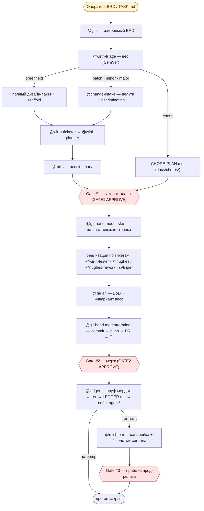

# rationaldev — концепция AI-first рационального SDLC

Дерзкая разработка ПО с ИИ на базе агентов «izi». Команда в своей основе — **человек +
машина**: инженер прорабатывает идеи **с ИИ** и воплощает их **с ИИ**. Это рациональная
автоматизация в духе Никлауса Вирта — не «инструмент рядом с инженером», а сама ткань работы.

Харнес ведёт **только те репозитории, которые построил сам** по жёсткому стандарту: есть
замороженный контракт (`api-specification/`), дизайн-пакет (`docs/design/slice-*/`) и своя
парадигма тестов. Стандарт **задаётся**, а не подбирается под чужой репозиторий; разведки и
подстройки под чужие парадигмы в конвейере нет.

## Научный фундамент

| Труд | Авторы |
|---|---|
| *Systematic Programming: An Introduction* | **Niklaus Wirth** |
| *A Structured Approach to Programming* | **Joan K. Hughes**, **Jay I. Michtom** |
| *Structured Programming: Theory and Practice* | **Richard C. Linger**, **Harlan D. Mills**, **Bernard I. Witt** (IBM) |

Ключевые идеи, на которых стоит весь процесс:

- **программа = дерево модулей** (Вирт): декомпозиция сверху вниз, пошаговое уточнение;
- **один модуль = один секрет** (Parnas): секрет задаёт радиус ряби изменения;
- **корректность по построению** (Mills, Cleanroom): доказательная разработка, а не «отладка тестами»;
- **математическая композиция модулей**: предусловие/постусловие, один data-аргумент, `Result<T,E>`;
- **документация = продукт** для четырёх JTBD-потребителей (Doc-as-Code).

«Качество достигается проектированием, а не тестированием» — поэтому из тестов остаются
**юниты по формуле** (`1 happy + Σ ветвей antecedent`) и **компонентные** (спецификация чёрного
ящика на границе контракта, `N = 1 + Σ различимых ветвей адаптера`); корректность модулей
доказывается композицией.

### Статьи автора — с чего всё началось

Дисциплина выросла из цикла статей на **codemonsters.team**; отправная точка —
[«Дисциплина проектирования программ. Скилл для opus и бэклог для sonnet»](https://codemonsters.team/blog/2026/05/01/rational-design-discipline/).

1. [Структурирование программ](https://codemonsters.team/blog/2025/12/12/structured-programming-essential/)
2. [Модульность программы](https://codemonsters.team/blog/2025/12/15/program-modules/)
3. [Правильность программы](https://codemonsters.team/blog/2025/12/30/program-correctness/)
4. [Сколько компонентных тестов нужно сервису](https://codemonsters.team/blog/2026/04/25/testing-mythology-component-tests/)
5. [Дисциплина проектирования программ (opus/sonnet)](https://codemonsters.team/blog/2026/05/01/rational-design-discipline/) — **отправная точка** харнеса

## Стандарт разработки — ядро, единое для всех конвейеров

1. **SemVer** — совместимость решает **вес** работы; транк версионируется тегом после мерджа.
2. **API-first** — контракт (OpenAPI/AsyncAPI · CLI-spec) первичен и **заморожен** до реализации;
   код следует контракту, не наоборот.
3. **Doc-as-Code** — README/ADR/C4/дизайн-пакет живут в репо, ревьюятся и машинно валидируются.
4. **Git-TBD** — trunk-based: короткая ветка `<type>/<slug>` от свежего транка, один PR, частый
   мерж; незавершённое — за **фиче-тогглом** (default OFF), релиз — **канарейкой** прямо в прод.
5. **Ядро проектирования + формула тестов** — дерево модулей, один секрет на модуль,
   `consequent ⊆ antecedent`; юниты по формуле, компонентные — изолированная проверка внешнего входа.
6. **Три человеческих гейта** — #1 акцепт плана, #2 мерж (токен `GATE2 APPROVE`), #3 приёмка
   прод-релиза после канарейки. Гейты не автокликабельны: маркер ставит гардрейл по точному токену.

## Классификатор веса — SemVer 2.0.0, дословно

Вес определяет `@wirth-triage`; `izi` роутит по его вердикту механически, не переклассифицируя.

> Given a version number MAJOR.MINOR.PATCH, increment the:
> **MAJOR** when you make incompatible API changes · **MINOR** when you add functionality in a
> backward compatible manner · **PATCH** when you make backward compatible bug fixes.

**Решающая ось одна — обратная совместимость документированного контракта.** Порядок вопросов:

0. Задача не трогает секрет модуля и контракт, не добавляет поведения, которое утверждал бы
   компонентный тест? → **`chore`** (плумбинг: CI, Dockerfile, конфиги, доки, бамп зависимости).
1. Кода/публичного API ещё нет (v0 → v1)? → **`greenfield`**.
2. Ломает существующих потребителей контракта или документированного поведения? → **`major`**.
3. Иначе добавляет функциональность? → **`minor`**.
4. Иначе (совместимый багфикс — код разъехался с контрактом, правка сходится к нему) → **`patch`**.

| Вес | Причина | Следствие | Совместимость |
|---|---|---|---|
| **patch** | код отклонился от документированного контракта (дефект) | правка восстанавливает соответствие спеке | backward compatible |
| **minor** | нужна новая способность | аддитивно, существующие вызовы не затронуты | backward compatible |
| **major** | контракт/поведение меняются несовместимо | потребители ломаются → миграция | **INCOMPATIBLE** |

**Причина ≠ вес:** багфикс, который **сам** ломает совместимость (потребитель зависел от старого
вывода в рамках контракта), — это **`major`**, не patch. Чистый рефактор с идентичным поведением и
спекой — **`patch`** (наименьший совместимый вес). Pre-release (`X.Y.Z-canary.N`) и build-метадата —
расширения формата, вес не меняют. Вес не выводится из BRD → **STOP**, вопрос оператору; выдумывать
вес запрещено.

## Вертикали — конвейер по весу

Одна ось: **вес**. Вертикаль = конвейер одного веса от BRD до тега на транке.

| Вес | Что | Дизайн | Бамп транка | Тоггл | Тесты |
|---|---|---|---|---|---|
| **greenfield** | сервиса/CLI ещё нет, v0 → v1 | полный вертикальный срез: FRD → срезы → замороженный контракт → дерево модулей → README → тикеты; **scaffold** из шаблона (`service`/`cli`) | `1.0.0` | новое OFF | юниты по формуле + полный компонентный набор |
| **patch** | обратно совместимый багфикс | по радиусу ряби (Parnas): `skip` — одна очевидная правка · `needed` — правка есть решение | `Z+1` | обычно нет | discriminating-тест old ≠ new там, где различие наблюдаемо; весь сьют зелёный |
| **minor** | аддитивная новая способность | `needed` **всегда** — новая поверхность есть контрактное решение | `Y+1.0` | **новое OFF** (обязательно) | компонентный на **новое** API (RED-first: было 404/отсутствует), существующие контрактные тесты **не правятся** |
| **major** | несовместимое изменение | `needed` — редизайн + миграция/депрекейшн | `X+1.0.0` | тоггл + миграционный путь | формула держится; **изменённые** компонентные дорабатываются под новый контракт |
| **chore** | репо-плумбинг | нет (не срез) | **no-bump** | — | команда верификации из `CHORE-PLAN.md` |

- **Аддитивность minor проверяется механически:** `node harness/validate-contract-diff.mjs
  --require-additive` → 0 breaking-классов. Найден слом ⇒ вес был неверен ⇒ **STOP** и ре-триаж как
  `major`. Не «на глаз».
- **major не блокируется**, но breaking-список из того же диффера обязан быть в теле PR
  (`BREAKING CHANGE`) вместе с миграционным путём.
- **no-bump — нормальный исход**, а не отказ: дифф трогает только плумбинг → тега нет, канарейки нет,
  прогон всё равно закрывается.

Пошаговые флоу (In/Out/проверка/раунды/тир на каждом шаге):
[`greenfield`](docs/flows/greenfield-flow.md) · [`patch`](docs/flows/patch-flow.md) ·
[`minor`](docs/flows/minor-flow.md) · [`major`](docs/flows/major-flow.md) ·
[`chore`](docs/flows/chore-flow.md). Формальные требования — [`requirements/semver-verticals.md`](requirements/semver-verticals.md).

## Закрытие прогона — из состояния в запись

`.agent/` истинно, **пока прогон открыт**. После Gate #2 и мерджа `@ledger` вызывает
детерминированный `harness/close-run.mjs`, который делает три акта в причинном порядке:

1. **пруф мерджа** (PR влит — читается у forge) → **тег** на транке (арифметика — `ci/semver-bump.mjs`,
   форма тега берётся у последнего релизного тега репо; тегов нет → дефолт `v`);
2. **запись** в `docs/changes/LEDGER.md` (append-only, самодостаточная);
3. **атомарный вайп** `.agent/` состояния прогона.

Тег ставит **только** `@ledger` — два источника тега недопустимы (`ci/recipes/*` остаются образцом
для репозиториев **без** харнеса). Без явного закрытия `gate1.approved` прошлой задачи пропустил бы
следующую через гейт.

## Агенты «izi» — роли

Кодовые имена подобраны по вкладу инженера; набор ролей **закрыт** — `izi` делегирует только им.

| Роль | izi | Что делает |
|---|---|---|
| `izi` | **Witt** | механический роутер-дирижёр: делегирует, читает однострочные статусы, держит гейты |
| `gilb` | **Gilb** | фронт-дор: сырое требование → измеримый BRD |
| `wirth-triage` | **Wirth** | классификатор **веса** (SemVer) + уровня greenfield |
| `wirth-intake/slicer/usecase/apidesigner/moduledesigner/ticketer/planner` | **Wirth** | FRD → срезы → use-case → контракт → дерево модулей → тикеты → план |
| `change-intake` | **Wirth** | дельта изменения, discriminating-сценарий, `design=needed\|skip` |
| `dijkstra` | **Dijkstra** | README репозитория по скиллу `documentation` |
| `mills` | **Mills** | ревью плана одним проходом: `OK \| blocker \| escalate` |
| `scaffolder` | **Wirth** | скелет из шаблона (только greenfield) |
| `wirth-tester` | **Wirth** | компонентные сценарии в исполняемые RED-тесты |
| `hughes` · `hughes-rework` | **Hughes** | реализация нового модуля · правка существующего под вес |
| `linger` | **Linger** | локальный фикс по блокеру/красному CI, предохранитель K=2 |
| `fagan` | **Fagan** | терминальная приёмка DoD; снимает `@wip`, сам не чинит |
| `git-hand` | **Torvalds** | ветка от свежего транка, коммит, push, PR, чтение CI |
| `ledger` | **Rochkind** | закрытие прогона: пруф мерджа → тег → LEDGER → вайп `.agent/` |
| `michtom` | **Michtom** | канарейка 1→5→25→100% + 4 золотых сигнала, вердикт/откат |

**Асимметрия генератор/критик:** кто создаёт артефакт — тот его не принимает.
**Почему `izi`:** строгая рациональность, поданная легко (`make it as simple as possible`, по Вирту).

## Поток (общий хребет, 3 человеческих гейта)

## Инварианты (across all)

- **Вес — суждение триажа, а не роутера**; единственная механическая ревизия веса — breaking-класс на
  `minor` ⇒ ре-триаж как `major`.
- **Контракт заморожен** до реализации; на `patch` он не трогается вовсе.
- **Discriminating-сценарий** обязателен: изменение доказывается old ≠ new на данных
  (для `minor` — отсутствие → присутствие).
- **Новое едет выключенным** (тоггл default OFF), релиз — канарейкой; включение — отдельный прогон.
- **Нет тестовых сред и стендов** — только CI и канареечный выкат на вариативные среды
  (VM/контейнер/serverless, k8s не обязателен); мониторинг — **4 золотых сигнала**.
- **Контрактные тесты** между компонентами проверяет [`pinout`](https://github.com/codemonstersteam/pinout);
  CI дополнительно гоняет утилиты [RRA](https://github.com/codemonstersteam/rra) и security-scan.
- **Прогон закрывается явно** — тег/no-bump, запись, вайп; тег ставит только `@ledger`.
- **Роль/скилл ≤ 300 строк**, формулировки плотные, якорными понятиями.
