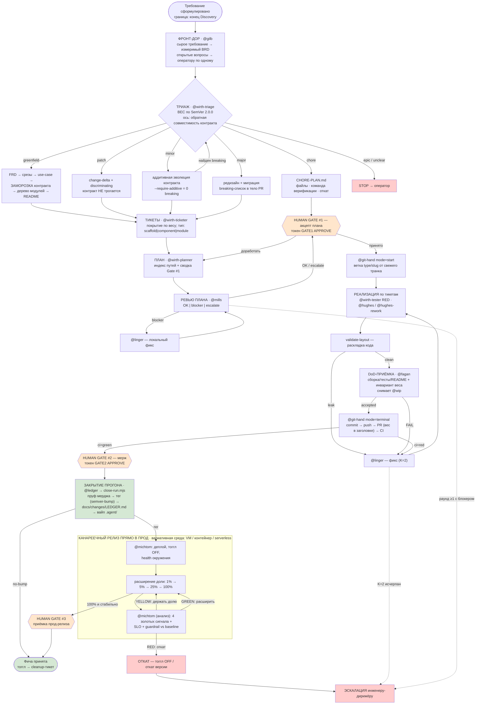

# Диаграмма целевого процесса

> Поток целиком: измеримый BRD → **вес по SemVer** → вертикаль → Gate #1 → реализация → DoD →
> PR/CI → Gate #2 → **закрытие прогона** (пруф мерджа → тег → `LEDGER.md` → вайп `.agent/`) →
> канарейка + 4 золотых сигнала → Gate #3. Роли и правила — [`00_PROCESS.md`](00_PROCESS.md);
> граф делегирования харнеса — [`harness-flow.md`](harness-flow.md); пошагово по весу —
> [`flows/`](flows/).
>
> `SDLC.svg` — **устаревшая** векторная схема (нарисована до SemVer-вертикалей); источник правды —
> Mermaid ниже.

## Общий хребет

## Что решает вес

| Вес | Голова конвейера | Транк | Канарейка |
|---|---|---|---|
| `greenfield` | полный дизайн-пакет + scaffold | `1.0.0` | да |
| `patch` | дельта + discriminating, контракт не трогается | `Z+1` | да |
| `minor` | аддитивная эволюция контракта, тоггл OFF | `Y+1.0` | да (способность выключена) |
| `major` | редизайн + миграция + breaking-список | `X+1.0.0` | да |
| `chore` | `CHORE-PLAN.md`, без дизайна и компонентных | **no-bump** | нет |

## Цикл Ralph Loop

Замкнутая часть `реализация → валидатор/DoD/CI → классификация → фикс` крутится до стоп-условия:

- **Успех:** `@fagan accepted` + зелёный CI на PR + инвариант веса доказан.
- **Принудительный выход:** предохранитель `@linger` K=2 или исчерпанный бюджет → эскалация человеку.
- **Защита:** агент не может менять тесты, CI-конфиги и пороги ради «позеленения»; на `minor` правка
  существующего контрактного теста — блокер (сигнал неверного веса).

## Цикл Rollout Loop

Замкнутая часть `расширить долю → наблюдение → вердикт → расширить/держать/откатить` (1% → 5% →
25% → 100%):

- **Успех:** 4 золотых сигнала и SLI в пределах SLO, guardrail не просел против baseline → 100% стабильно.
- **Держать (YELLOW):** сигналы пограничны или окна не хватило — расширение запрещено.
- **Принудительный выход (RED):** немедленный откат (тоггл OFF) + эскалация.
- **Асимметрия:** фаза выката (малый тир) не совпадает с фазой анализа здоровья (большой тир).
- **Защита:** нельзя ослаблять SLO, глушить алерты или трактовать отсутствие данных как «зелёно».
