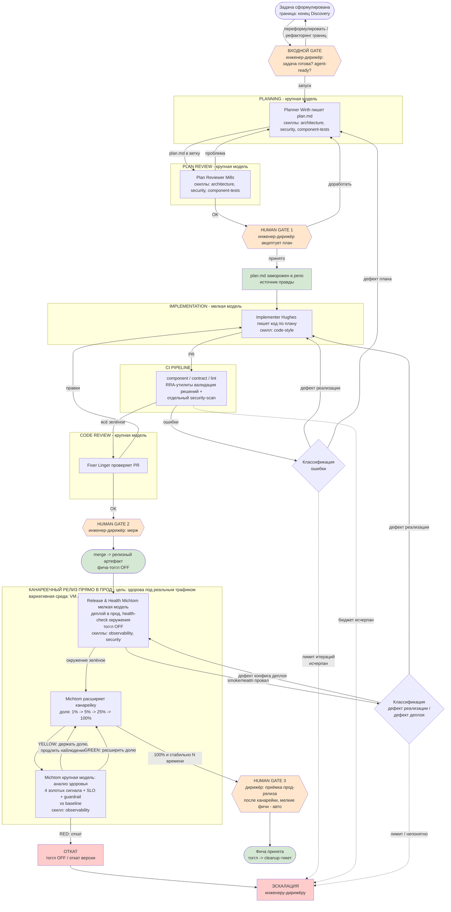

# Диаграмма целевого процесса

> **Векторная схема процесса:** [`SDLC.svg`](SDLC.svg) — открывается в браузере,
> отражает актуальный поток CI → канарейка (прежний растровый `SDLC.jpeg` удалён).
> Актуальный поток (как в `README.md`): PLANNING → PLAN REVIEW → Human Gate #1 →
> IMPLEMENTATION → CI (RRA-утилиты + security-scan) → CODE REVIEW → Human Gate #2 →
> канареечный релиз прямо в прод (Release & Health, агент Michtom: выкат ⇄ 4 золотых
> сигнала, доля канарейки 1%→5%→25%→100%) → Human Gate #3 (приёмка прод-релиза).
> Mermaid-схема ниже — тот же поток в текстовом виде.

## Цикл Ralph Loop

Замкнутая часть `IMPLEMENTATION → CI → классификация → IMPLEMENTATION/PLANNING` крутится до выполнения стоп-условия:

- **Успех:** всё зелёное в CI + пройден code review крупной модели.
- **Принудительный выход:** превышен лимит итераций (рекоменд. 5 фиксов / 2 репланирования) или исчерпан бюджет токенов/GPU-времени → эскалация человеку.
- **Защита:** агент не может менять тесты, CI-конфиги и пороги покрытия для «позеленения» — такие изменения требуют отдельного human review.

## Цикл Rollout Loop

Замкнутая часть `расширить долю канарейки → POST-DEPLOY наблюдение → вердикт → расширить/держать/откатить` крутится по доле канарейки (1% → 5% → 25% → 100%) до выполнения стоп-условия:

- **Успех:** все 4 золотых сигнала и SLI в пределах SLO, guardrail не просел против baseline на достаточном окне → раскатка дошла до 100% и стабильна → фича принята.
- **Держать (YELLOW):** сигналы пограничны или окна наблюдения не хватило → текущая доля канарейки удерживается, расширение запрещено.
- **Принудительный выход (RED):** нарушен SLO / всплеск ошибок-латентности / просадка guardrail / горит error budget → немедленный откат (тоггл OFF) и эскалация человеку.
- **Асимметрия:** внутри Release & Health (Michtom) фаза выката (мелкая модель) катит, а фаза анализа здоровья (крупная модель) оценивает и решает об откате — генератор и критик не совпадают, как и в CI/code review.
- **Защита:** агент не может ослаблять SLO, глушить алерты или трактовать отсутствие данных как «зелёно» ради продвижения раскатки — анти-gaming, симметричный запрету «позеленения» тестов.
