# Концепт — детерминированный workflow разработки API-сервиса

> **Цель:** мультиагентская разработка в **детерминированном воркфлоу** — конвейер ролей от требований
> (`TASK.md`) до здоровой фичи в проде через **три Human Gate**. Каждый этап имеет проверяемый
> вход/выход; между этапами стоят **детерминированные валидаторы** (не LLM), которые ловят типовые
> провалы слабой модели до того, как ошибка уйдёт дальше.
>
> Этот документ — про **процесс разработки** (граф ролей). Архитектуру самого́ *сервиса* документирует
> C4 по уровням (C1 — на лендинге платформы, C2/C3 — в `docs/architecture.md` сервиса; см. скилл
> [`documentation`](../skills/lib/documentation/SKILL.md)). Процесс — это поток, поэтому он нарисован
> как Mermaid **flowchart** (рендерится на GitHub, проходит `validate-mermaid`).

## Вектор: где мы на осях процессов

Харнес нацелен на матрицу процессов; сейчас в **отладке** — одна ячейка (выделена):

| Ось | Значения | Сейчас |
|---|---|---|
| **Задача** | epic · фича · улучшение · баг-хотфикс · рефакторинг | **фича / модуль** |
| **Приложение** | web · mobile · cli · **go-api** | **go-api** |
| **Среды** | **CI** · **PROD** (канарейка) | **CI → PROD-канарейка** |

Остальные ячейки (web/mobile/cli, epic/hotfix/рефакторинг) — вектор, ещё не реализованы.
Граф ниже — это ячейка `задача=фича · приложение=go-api · среды=CI→PROD`.

## Граф конвейера

Легенда: 🟪 **izi** — механический роутер (без LLM-решений по содержанию, durable ticket-ledger) ·
🟦 LLM-роль (генерирует артефакт) · 🟩 детерминированный валидатор (гейт, не LLM) ·
🟧 **Human Gate** (решение человека).

```mermaid
flowchart TD
    classDef human fill:#ffe8cc,stroke:#e8590c,stroke-width:2px,color:#000
    classDef gate fill:#fff3bf,stroke:#f08c00,stroke-width:2px,color:#000
    classDef llm fill:#e7f5ff,stroke:#1971c2,color:#000
    classDef det fill:#ebfbee,stroke:#2f9e44,color:#000
    classDef router fill:#f3f0ff,stroke:#7048e8,color:#000

    TASK["TASK.md — требования (Discovery: человек + ИИ)"]:::human

    subgraph PLAN["ПЛАНИРОВАНИЕ — Wirth-роли, izi маршрутизирует, depth-1"]
        direction TB
        IZI["izi — механический роутер + ticket-ledger"]:::router
        TRIAGE["wirth-triage — тип задачи / scope"]:::llm
        INTAKE["wirth-intake — FRD + счёт use-case"]:::llm
        VFRD(["validate-frd + UC — псевдо-UC?"]):::det
        SLICER["wirth-slicer — вертикальные срезы"]:::llm
        VSLI(["validate-slices — #срезов ≤ #endpoints"]):::det
        USECASE["wirth-usecase — Cockburn UC на срез"]:::llm
        APIDES["wirth-apidesigner — OpenAPI, ЗАМОРОЗКА"]:::llm
        VCON(["validate-contract-frozen"]):::det
        MODDES["wirth-moduledesigner — module-tree + C4"]:::llm
        VMER(["validate-mermaid — C4 рендерится?"]):::det
        TICKET["wirth-ticketer — тикеты + DoD-закрытие"]:::llm
        VTIC(["validate-tickets — заголовки/skills"]):::det
        PLANNER["wirth-planner — PLAN.md на срез"]:::llm
        MILLS["mills — ревью плана, ПЕРЕзапускает ВСЕ валидаторы"]:::llm
    end

    GATE1{"Human Gate #1 — акцепт плана"}:::gate

    subgraph IMPL["РЕАЛИЗАЦИЯ"]
        direction TB
        SCAF["scaffolder — клон шаблона, wiring"]:::llm
        TESTER["wirth-tester — компонентные тесты RED"]:::llm
        HUGHES["hughes — модули до GREEN"]:::llm
        LINGER["linger — приёмка / CI / фиксы"]:::llm
    end

    GATE2{"Human Gate #2 — мерж"}:::gate

    subgraph REL["РЕЛИЗ"]
        direction TB
        MICHTOM["michtom — канарейка + 4 золотых сигнала"]:::llm
    end

    GATE3{"Human Gate #3 — приёмка прод-релиза"}:::gate
    DONE["Здоровая фича в проде"]:::human

    TASK --> IZI
    IZI --> TRIAGE
    TRIAGE --> INTAKE
    INTAKE --> VFRD
    VFRD --> SLICER
    SLICER --> VSLI
    VSLI --> USECASE
    USECASE --> APIDES
    APIDES --> VCON
    VCON --> MODDES
    MODDES --> VMER
    VMER --> TICKET
    TICKET --> VTIC
    VTIC --> PLANNER
    PLANNER --> MILLS
    MILLS --> GATE1
    GATE1 -->|акцепт| SCAF
    GATE1 -->|отказ| IZI
    SCAF --> TESTER
    TESTER --> HUGHES
    HUGHES --> LINGER
    LINGER -->|RED / FAIL| HUGHES
    LINGER --> GATE2
    GATE2 -->|мерж| MICHTOM
    MICHTOM -->|GREEN — расширить| GATE3
    MICHTOM -->|RED — откат| LINGER
    GATE3 --> DONE
```



## Как читать граф

- **Асимметрия генератор/критик.** Кто генерирует артефакт (план, код, выкат) — тот его не принимает.
  Ревьюер (`mills`) и приёмщик (`linger`) — отдельные роли; человек держит три гейта.
- **Детерминированные валидаторы — не LLM.** 🟩-узлы (`validate-frd/slices/mermaid/contract-frozen/tickets`)
  — чистая логика (`harness/lib/validators.mjs`), ловят классы провалов слабой модели: псевдо-use-case,
  переусложнённое дробление срезов, битый Mermaid-C4, разморозку контракта, кривые заголовки тикетов.
  Каждый стоит **сразу за своим авторским этапом** (consequent автора) и **повторно** прогоняется у `mills`
  как чек-лист перед Gate #1 — прозе «это разные входы» валидатор не верит.
- **izi — механика, а не решение.** Роутер только маршрутизирует и ведёт durable ticket-ledger
  (`docs/design/slice-<name>/…` + `.agent/planner/done.log`); он **не** принимает решений по содержанию и
  проверяет артефакты только по зашитому пути (`read`/`ls`, не `glob`). Это делает поток идемпотентным:
  упавший тикет ретраится **точечно**, готовые — пропускаются.
- **Три петли обратной связи.** `Gate #1 → отказ → izi` (переплан), `linger → RED/FAIL → hughes`
  (доводка до зелёного), `michtom → RED → linger` (откат канарейки).

## Почему это эффективно — принцип минимального контекста

**Главная сила флоу — не в том, что ролей много, а в том, что каждой роли на вход подаётся
минимум.** Исполнителю (`@hughes`, `@scaffolder`, `@wirth-tester`) НЕ отдаётся вся задача и не
разрешается разведывать проект. Он получает **один тикет** со строгим заголовком и точными входами —
и всё, что нужно для одного модуля, уже лежит в тикете:

- **строгий машиночитаемый заголовок** (`id`, `type`, `slice`, `blocked_by`, `inputs`, `io`, `skills`)
  — по нему `izi` маршрутизирует **механически**, не читая тело;
- **io-router**: по полю `io:` модуля детерминированно подцепляются ровно нужные скиллы
  (`none`→`[]`, `http`→`http-io`, `db`→`db-io`+`db-schema`, …) — исполнитель **не выбирает** скиллы сам;
- **контракт модуля** (Input/Deps/antecedent/consequent), точный список юнит-тестов по формуле,
  сценарии компонентных тестов — и ничего лишнего.

> **Тест хорошего тикета:** субагент-исполнитель **без всякого другого контекста** может закрыть тикет.
> Если для понимания тикета нужен весь дизайн-пакет — тикет слишком большой, его дробят (один
> модуль / один срез).

Это даёт три эффекта: **экономию токенов** (не пересылаем весь проект на каждый шаг — а именно
пересылка входного контекста, а не генерация, доминирует в стоимости), **предсказуемость слабой
модели** (Qwen-размер справляется с узким тикетом там, где «сделай сервис» разваливается) и
**идемпотентность** (упавший тикет ретраится точечно). Подробнее — скилл
[`implementation-ticket-writer`](../skills/lib/implementation-ticket-writer/SKILL.md), §«Minimal-context
principle».

## Пошаговый прогон на примере

**Пример: на вход задача, которая содержит формулировку** (фрагмент `TASK.md` — «замороженный
промпт», одинаковый для всех прогонов):

> Build a small HTTP service in **Go** that exposes one REST endpoint and serves a catalogue of
> repositories grouped by platform. **Endpoint:** `GET /services?sort=platform,service`. **Data
> store:** `services.yaml` — file-based stand-in for a DBMS, accessed through a dedicated
> storage/repository module. **Response:** JSON array sorted by `platform`, then `service`; on
> success `200 application/json`. UC1 — list services; UC2 — store missing / empty / malformed.

Дальше `izi` ведёт её по конвейеру. Что каждый этап получает на **вход** и отдаёт на **выход**
(на этом примере):

| Этап (роль) | Вход | Выход (на примере) |
|---|---|---|
| **triage** (`wirth-triage`) | `TASK.md` | тип=**фича**, scope=**1 endpoint**, приложение=go-api |
| **intake** (`wirth-intake`) | `TASK.md` | `frd.md`: problem, актёры, **2 use-case** (UC1 список · UC2 сбой стора) → `validate-frd` ловит псевдо-UC |
| **slicer** (`wirth-slicer`) | `frd.md` | `slices.md`: **1 срез** `slice-01-list-services-by-platform` → `validate-slices` (#срезов=1 ≤ #endpoints=1) |
| **usecase** (`wirth-usecase`) | срез + FRD | `use-case.md`: Cockburn fully-dressed — main + extensions (missing/empty/malformed) |
| **apidesigner** (`wirth-apidesigner`) | use-case | `openapi.yaml` **ЗАМОРОЖЕН**: `GET /services`→`200` array; `500 {error.code}` → `validate-contract-frozen` |
| **moduledesigner** (`wirth-moduledesigner`) | contract | `module-tree.md` (handler `io:none` · storage-port · domain-sort) + `c4.md` → `validate-mermaid` |
| **ticketer** (`wirth-ticketer`) | module-tree + contract | `tickets/ticket-01..07.md` (scaffold · component-RED · модули · wiring · integration-DoD) → `validate-tickets` |
| **planner** (`wirth-planner`) | тикеты | `PLAN.md` среза (порядок, `blocked_by`) |
| **mills** (ревью) | весь пакет среза | ПЕРЕзапуск ВСЕХ валидаторов → вердикт → **Gate #1** |
| **scaffolder** | ticket-01 | клон `template-go-api`, wiring, зелёный smoke |
| **wirth-tester** | ticket-02 | 4 сценария `.feature` **RED** против OpenAPI |
| **hughes** | ticket-03..06 | модули до **GREEN** (юнит + компонентные) |
| **linger** (приёмка) | зелёный срез | снятие `@wip`, CI, фиксы → **Gate #2 (мерж)** |
| **michtom** | мерж | канарейка за тогглом + 4 золотых сигнала → **Gate #3** |

Ключевое: `hughes` на шаге `ticket-03` видит **только** `ticket-03` + его `inputs` (контракт модуля,
нужный срез спеки) — не FRD, не другие тикеты, не весь репозиторий.

## Пример тикета

Реальный `ticket-02` из прогона выше — компонентные тесты (RED). Виден строгий заголовок (по нему
маршрутизирует `izi`) и самодостаточный минимальный контекст:

```md
---
id: 02
type: component
slice: slice-01-list-services-by-platform
blocked_by: [01]
inputs: [api-specification/openapi.yaml, docs/design/slice-01-list-services-by-platform/use-case.md,
         docs/design/slice-01-list-services-by-platform/contracts.md]
skills: [component-tests]
---

### TICKET 02 — component tests (RED): Gherkin scenarios against the OpenAPI contract

**Context (only this component-test ticket):**
- Write Gherkin `.feature` in `component-tests/features/` — black box over HTTP, run by godog.
  Assert responses against the FROZEN OpenAPI schema (status, Content-Type, body shape, field types).

| # | Scenario | Given | When | Then |
|---|---|---|---|---|
| 1 | Happy path — populated, sorted | valid `services.yaml` | `GET /services?sort=platform,service` | `200` json; array sorted platform→service; fields platform,service,git_url,commits_2m |
| 3 | Data store missing | configured path absent | `GET /services?…` | `500 {"error":{"code":"STORE_NOT_FOUND"}}` |
| … | (empty-but-valid, malformed) | | | |

**Acceptance:**
- [ ] `component-tests/features/*.feature` — все сценарии, тег `@wip`, RED по бизнес-причине.
- [ ] Проверка против OpenAPI-схемы (не `curl|jq`).
```

`skills: [component-tests]` — это ровно вывод io-router по `type: component`; `validate-tickets`
падает, если скиллов больше/меньше. Исполнитель ничего не выбирает — берёт что дано.

## Сильные стороны планирования и нарезки на тикеты

- **Асимметрия генератор/критик** — автор артефакта его не принимает; ревьюер (`mills`) крупнее.
- **Заморозка контракта** (`apidesigner`) до реализации — исполнители кодят против неизменного OpenAPI;
  `validate-contract-frozen` ловит разморозку.
- **Один вход = один срез = один `Request`** — срез демоится сам по себе; `validate-slices` не даёт
  расплодить срезы из outcome/boot/error (частый провал слабой модели).
- **Детерминированная маршрутизация** — `izi` и io-router работают по машиночитаемым полям, без
  «суждения»; решения приходятся на LLM-роли, механику несут скрипты.
- **Идемпотентность** — durable ticket-ledger; упал `ticket-07` — ретраится только он, готовые пропущены.

## Как проверяется качество — валидаторы и eval-слой

Два уровня контроля, оба не полагаются на «модель сама себя оценит»:

1. **Детерминированные валидаторы-гейты** (🟩 на графе) — чистая логика `harness/lib/validators.mjs`,
   гоняются как consequent автора и повторно у `mills` перед Gate #1: `validate-frd` (+UC),
   `validate-slices`, `validate-mermaid`, `validate-contract-frozen`, `validate-tickets`. Ловят
   классы провалов до того, как ошибка уйдёт дальше по конвейеру.
2. **Eval-слой (trajectory)** — оценка **как агент шёл**, а не только что вышло
   ([`experiments/token-bench/runners/`](../experiments/token-bench/runners/)):
   - `eval-run.mjs` — **детерминированные** детекторы по `flow.jsonl`/`usage.jsonl` по трём измерениям:
     **эффективность** (турны, тул-вызовы, кривые tool-calls, ретраи, токены), **безопасность**
     (инспекция args write/edit/bash — запретные пути, касание gate1 — по логике `rational-guardrail`,
     не грепом промпта), **успех** (возвратная строка контракта `ticket NN → green` / STOP / FAIL).
     `exit 1` при любом safety-нарушении — как MUST-инвариант.
   - `eval-judge.mjs` — **LLM-as-judge** поверх детекторов: судит только субъективное («оправдан ли
     churn/ретрай», «достаточен ли выход по контракту роли») по компактному дайджесту шага, с
     обязательной цитатой из лога под каждый вердикт.

## На чём основан флоу — труды и статьи

Флоу не изобретён с нуля — это перенос классической **дисциплины проектирования и доказательной
корректности** на мультиагентскую разработку. Роли названы в честь инженеров, чей вклад они несут:

**Труды (фундамент):**
- **Niklaus Wirth**, *Systematic Programming* — пошаговое уточнение, дерево модулей, минимализм
  (роли `wirth-*`, планирование).
- **Joan K. Hughes, Jay I. Michtom**, *A Structured Approach to Programming* — прикладное структурное
  кодирование (`hughes`) и системная обратная связь (`michtom`).
- **Richard C. Linger, Harlan D. Mills, Bernard I. Witt**, *Structured Programming: Theory and
  Practice* (IBM Cleanroom) — **корректность по построению**, верификация вместо «отладки тестами»
  (`mills` — ревью, `linger` — верификация/дефекты).
- **Alistair Cockburn**, *Writing Effective Use Cases* — fully-dressed system use case (скилл
  `cockburn-use-case`). **Simon Brown, C4 model** — уровни C1–C3 (скилл `c4`).

**Статьи автора** (отправная точка и дисциплина харнеса):
- Проектирование: [Структурирование программ](https://codemonsters.team/blog/2025/12/12/structured-programming-essential/)
  · [Модульность программы](https://codemonsters.team/blog/2025/12/15/program-modules/)
  · [Дисциплина проектирования программ (opus/sonnet)](https://codemonsters.team/blog/2026/05/01/rational-design-discipline/)
  — **отправная точка** харнеса.
- Корректность и тестирование: [Правильность программы](https://codemonsters.team/blog/2025/12/30/program-correctness/)
  · [Сколько компонентных тестов нужно сервису](https://codemonsters.team/blog/2026/04/25/testing-mythology-component-tests/).

## Артефакты по этапам

Планирование пишет durable пакет на срез — его и ревьюит человек на Gate #1:

```
docs/design/slice-<name>/
  use-case.md      Cockburn UC (wirth-usecase)
  module-tree.md   дерево модулей (wirth-moduledesigner)
  c4.md            C4 в Mermaid (wirth-moduledesigner) — проходит validate-mermaid
  contracts.md     срез замороженного OpenAPI (wirth-apidesigner)
  PLAN.md          план среза (wirth-planner)
  tickets/ticket-N.md   тикеты реализации (wirth-ticketer)
.agent/planner/
  frd.md           FRD (wirth-intake) · slices.md (wirth-slicer) · done.log (izi ledger)
```

## Связанные документы

- [`README.md`](../README.md) — вектор проекта, роли, быстрый старт.
- [`docs/00_PROCESS.md`](00_PROCESS.md) — полное описание процесса (роли, гейты, канареечный CD).
- [`CONCEPT.md`](../CONCEPT.md) · [`AGENTS.md`](../AGENTS.md) — фундамент и неизменяемые правила.
- [`docs/SDLC.svg`](SDLC.svg) — векторная схема CI→канарейка (тот же поток, другой ракурс).
- Скилл [`documentation`](../skills/lib/documentation/SKILL.md) — где живёт C4 **сервиса** (C1–C3), в отличие
  от этого графа **процесса**.
