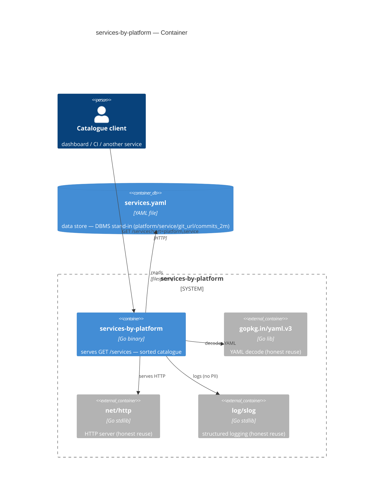

# Концепт — детерминированный workflow разработки API-сервиса

> **Цель:** мультиагентская разработка в **детерминированном воркфлоу** — конвейер ролей от требований
> (`TASK.md`) до здоровой фичи в проде через **три Human Gate**. Каждый этап имеет проверяемый
> вход/выход; между этапами стоят **детерминированные валидаторы** (не LLM), которые ловят типовые
> провалы слабой модели до того, как ошибка уйдёт дальше.
>
> Этот документ — про **процесс разработки** (граф ролей). Архитектуру самого́ *сервиса* документирует
> C4 по уровням (C1 — на лендинге платформы, C2/C3 — в `docs/architecture.md` сервиса; см. скилл
> [`documentation`](../skills/lib/documentation/SKILL.md)). Процесс — это поток, поэтому он нарисован
> как Mermaid **flowchart** (рендерится на GitHub, проходит `validate-mermaid`).

## Вектор: где мы на осях процессов

Харнес нацелен на матрицу процессов; сейчас в **отладке** — одна ячейка (выделена):

| Ось | Значения | Сейчас |
|---|---|---|
| **Задача** | epic · фича · улучшение · баг-хотфикс · рефакторинг | **фича / модуль** |
| **Приложение** | web · mobile · cli · **go-api** | **go-api** |
| **Среды** | **CI** · **PROD** (канарейка) | **CI → PROD-канарейка** |

Остальные ячейки (web/mobile/cli, epic/hotfix/рефакторинг) — вектор, ещё не реализованы.
Граф ниже — это ячейка `задача=фича · приложение=go-api · среды=CI→PROD`.

## Граф конвейера

Легенда: 🟪 **izi** — механический роутер (без LLM-решений по содержанию, durable ticket-ledger) ·
🟦 LLM-роль (генерирует артефакт) · 🟩 детерминированный валидатор (гейт, не LLM) ·
🟧 **Human Gate** (решение человека).


## Как читать граф

- **Асимметрия генератор/критик.** Кто генерирует артефакт (план, код, выкат) — тот его не принимает.
  Ревьюер (`mills`) и приёмщик (`linger`) — отдельные роли; человек держит три гейта.
- **Детерминированные валидаторы — не LLM.**   
  🟩 - узлы (`validate-frd/slices/mermaid/contract-frozen/tickets`)
  — чистая логика (`harness/lib/validators.mjs`), ловят классы провалов слабой модели: псевдо-use-case,
  переусложнённое дробление срезов, битый Mermaid-C4, разморозку контракта, кривые заголовки тикетов.
  Каждый стоит **сразу за своим авторским этапом** (consequent автора) и **повторно** прогоняется у `mills`
  как чек-лист перед Gate #1 — прозе «это разные входы» валидатор не верит.
- **izi — механика, а не решение.** Роутер только маршрутизирует и ведёт durable ticket-ledger
  (`docs/design/slice-<name>/…` + `.agent/planner/done.log`); он **не** принимает решений по содержанию и
  проверяет артефакты только по зашитому пути (`read`/`ls`, не `glob`). Это делает поток идемпотентным:
  упавший тикет ретраится **точечно**, готовые — пропускаются.  
- **Три петли обратной связи.** `Gate #1 → отказ → izi` (переплан), `linger → RED/FAIL → hughes`
  (доводка до зелёного), `michtom → RED → linger` (откат канарейки).

## Почему это эффективно — принцип минимального контекста

**Главная сила флоу — не в том, что ролей много, а в том, что каждой роли на вход подаётся
минимум.** Исполнителю (`@hughes`, `@scaffolder`, `@wirth-tester`) НЕ отдаётся вся задача и не
разрешается разведывать проект. Он получает **один тикет** со строгим заголовком и точными входами —
и всё, что нужно для одного модуля, уже лежит в тикете:

- **строгий машиночитаемый заголовок** (`id`, `type`, `slice`, `blocked_by`, `inputs`, `io`, `skills`)
  — по нему `izi` маршрутизирует **механически**, не читая тело;
- **io-router**: по полю `io:` модуля детерминированно подцепляются ровно нужные скиллы
  (`none`→`[]`, `http`→`http-io`, `db`→`db-io`+`db-schema`, …) — исполнитель **не выбирает** скиллы сам;
- **контракт модуля** (Input/Deps/antecedent/consequent), точный список юнит-тестов по формуле,
  сценарии компонентных тестов — и ничего лишнего.

> **Тест хорошего тикета:** субагент-исполнитель **без всякого другого контекста** может закрыть тикет.
> Если для понимания тикета нужен весь дизайн-пакет — тикет слишком большой, его дробят (один
> модуль / один срез).

Это даёт три эффекта: **экономию токенов** (не пересылаем весь проект на каждый шаг — а именно
пересылка входного контекста, а не генерация, доминирует в стоимости), **предсказуемость слабой
модели** (Qwen-размер справляется с узким тикетом там, где «сделай сервис» разваливается) и
**идемпотентность** (упавший тикет ретраится точечно). Подробнее — скилл
[`implementation-ticket-writer`](../skills/lib/implementation-ticket-writer/SKILL.md), §«Minimal-context
principle».

## Пошаговый прогон на примере

**Пример: на вход задача, которая содержит формулировку** (фрагмент `TASK.md` — «замороженный
промпт», одинаковый для всех прогонов):

> Build a small HTTP service in **Go** that exposes one REST endpoint and serves a catalogue of
> repositories grouped by platform. **Endpoint:** `GET /services?sort=platform,service`. **Data
> store:** `services.yaml` — file-based stand-in for a DBMS, accessed through a dedicated
> storage/repository module. **Response:** JSON array sorted by `platform`, then `service`; on
> success `200 application/json`. UC1 — list services; UC2 — store missing / empty / malformed.

Дальше `izi` ведёт её по конвейеру. Что каждый этап получает на **вход** и отдаёт на **выход**
(на этом примере):

| Этап (роль) | Вход | Выход (на примере) |
|---|---|---|
| **triage** (`wirth-triage`) | `TASK.md` | тип=**фича**, scope=**1 endpoint**, приложение=go-api |
| **intake** (`wirth-intake`) | `TASK.md` | `frd.md`: problem, актёры, **2 use-case** (UC1 список · UC2 сбой стора) → `validate-frd` ловит псевдо-UC |
| **slicer** (`wirth-slicer`) | `frd.md` | `slices.md`: **1 срез** `slice-01-list-services-by-platform` → `validate-slices` (#срезов=1 ≤ #endpoints=1) |
| **usecase** (`wirth-usecase`) | срез + FRD | `use-case.md`: Cockburn fully-dressed — main + extensions (missing/empty/malformed) |
| **apidesigner** (`wirth-apidesigner`) | use-case | `openapi.yaml` **ЗАМОРОЖЕН**: `GET /services`→`200` array; `500 {error.code}` → `validate-contract-frozen` |
| **moduledesigner** (`wirth-moduledesigner`) | contract | `module-tree.md` (handler `io:none` · storage-port · domain-sort) + `c4.md` → `validate-mermaid` |
| **ticketer** (`wirth-ticketer`) | module-tree + contract | `tickets/ticket-01..07.md` (scaffold · component-RED · модули · wiring · integration-DoD) → `validate-tickets` |
| **planner** (`wirth-planner`) | тикеты | `PLAN.md` среза (порядок, `blocked_by`) |
| **mills** (ревью) | весь пакет среза | ПЕРЕзапуск ВСЕХ валидаторов → вердикт → **Gate #1** |
| **scaffolder** | ticket-01 | клон `template-go-api`, wiring, зелёный smoke |
| **wirth-tester** | ticket-02 | 4 сценария `.feature` **RED** против OpenAPI |
| **hughes** | ticket-03..06 | модули до **GREEN** (юнит + компонентные) |
| **linger** (приёмка) | зелёный срез | снятие `@wip`, CI, фиксы → **Gate #2 (мерж)** |
| **michtom** | мерж | канарейка за тогглом + 4 золотых сигнала → **Gate #3** |

Ключевое: `hughes` на шаге `ticket-03` видит **только** `ticket-03` + его `inputs` (контракт модуля,
нужный срез спеки) — не FRD, не другие тикеты, не весь репозиторий.

## Прогон с конкретными примерами

**Реальный прогон** задачи `services-by-platform` (артефакты из `test-harnes-data/03-07-2026/1-harnes`).
Каждый шаг — строкой таблицы (**шаг → комментарий**); артефакты шага — в раскрывашке под ним. Так
читатель видит, какие **однострочные задачи** `izi` шлёт субагентам и что рождается на выходе.

> **Инвариант флоу:** субагенту `izi` передаёт **только его тикет + пути из `inputs`** — не весь
> бэклог и не проект. Роли-исполнители не разведывают кодовую базу.

| Шаг | Комментарий |
|---|---|
| **Вход** — `TASK.md` | Замороженный промпт (одинаков для всех прогонов) — что подаём на вход конвейеру. |

<details>
<summary>📄 <b>TASK.md</b> — задача на входе</summary>

# Bench task — service `services-by-platform` (Go)

> This is the **frozen prompt** handed identically to every agent/harness under test.
> Do not edit between runs — edits invalidate the comparison.

## Business requirement

Build a small HTTP service in **Go** that exposes one REST endpoint and serves a catalogue of
repositories grouped by platform.

- **Endpoint:** `GET /services?sort=platform,service`
- **Data store:** `services.yaml` is the service's **data store — a file-based stand-in for a
  DBMS**. Access it through a dedicated **storage/repository module** (so it could be swapped
  for a real database later, without touching the handler/domain). Its location is part of the
  service **configuration** (like a DB DSN/connection string), default `services.yaml`.
- **Response:** a JSON **array**, sorted by `platform` ascending, then by `service` ascending.
  Each element has exactly these fields:

  | field | type | meaning |
  |---|---|---|
  | `platform` | string | platform name |
  | `service` | string | service (repository) name |
  | `git_url` | string | link to the git repository |
  | `commits_2m` | integer | number of commits in the last 2 months |

  > `commits_2m` is a **precomputed snapshot already present in `services.yaml`** — read it and
  > serve it as-is. (No git access, no network — kept deterministic on purpose.)

- On success respond `200` with `Content-Type: application/json`.

## Actors & stakeholders
- **Primary actor:** a client (dashboard / CI / another service) that queries the catalogue, read-only, over HTTP.
- **Stakeholder:** the platform operator who maintains the `services.yaml` data store.
- **External systems / interfaces:** inbound HTTP (the one endpoint); the data store (`services.yaml`, DB stand-in). No outbound calls, no network, no auth (internal service).

## Use cases (titles — to be formalized by the implementing harness)
- **UC1 — List services by platform:** client GETs the catalogue → `200` + sorted JSON array per the contract.
- **UC2 — Data store missing / empty / malformed:** outcome per the failure-mode map (distinct `error.code` + HTTP status per case).

## Non-functional requirements
- Read-only; no auth (internal); **no PII** in data or logs.
- Small dataset (tens–hundreds of rows); concurrent reads MUST be safe.
- **Deterministic** output (stable sort); target p99 `< 50 ms` at this dataset size.
- Structured logs; the service MUST refuse to start on invalid config (fail fast).

## Glossary
- **platform** — grouping key (e.g. web / mobile / backend). **service** — a repository name.
- **commits_2m** — precomputed 2-month commit count (snapshot in the store). **data store** — `services.yaml` (DBMS stand-in).

## Assumptions / out of scope
- No write/update endpoints, no pagination, no filtering, no DB migration; a single data store.
- Sort is fixed (`platform`, then `service`). `commits_2m` is served as-is (not computed).

## Input format (`services.yaml`)

```yaml
services:
  - platform: web
    service: storefront
    git_url: https://git.example.com/web/storefront
    commits_2m: 42
  # ... more entries
```

## Hard constraints (so the result is verifiable, identical for both harnesses)

- The program MUST be a **proper modular service**, **not one `main.go`**. A thin `main`
  package at the module root only wires dependencies; the logic lives in separate packages:
  a **storage/repository** module (reads the `services.yaml` data store behind an interface,
  swappable for a real DB), a **domain** module (sort/business rules), and an **HTTP handler**
  module (e.g. `internal/storage`, `internal/catalog`, `internal/httpapi`). It MUST still build
  with `go build ./...` and run as a single binary.
- **Configuration from files/env — NO hardcode.** The listen port, the `services.yaml` path,
  and every other parameter MUST come from a **config file** (e.g. `config.yaml`) and/or env
  vars (env overrides file). **No hardcoded ports, paths, or magic constants** in the code
  (explicit over implicit). `PORT` env still honored (default `8080`).
- Output field names MUST be exactly `platform`, `service`, `git_url`, `commits_2m`.
- Sort MUST be `platform` asc, then `service` asc. JSON array, not an object.

## API contract (OpenAPI) — MANDATORY

The service MUST be **contract-first**: deliver **`api-specification/openapi.yaml`** describing
`GET /services?sort=platform,service` — the response schema (array of objects with the four fields and
their types), the `200` response, and the error responses (`4xx/5xx`) with an `error.code`.
The implementation MUST conform to this contract; the component tests (below) are written
**against this OpenAPI spec**.

## Failure-mode map — MANDATORY

The `README.md` MUST contain a **`## Карта режимов отказа`** table: one row per distinguishable
failure mode (missing/empty/malformed `services.yaml`, bad config) with columns `error.code`,
HTTP status, client action, operator action. Each failure mode MUST have a matching use-case
component test.

## Component tests — Gherkin (from the OpenAPI contract), in Docker, by use case — MANDATORY

The service MUST be covered by **component tests written in Gherkin** (`.feature` scenarios,
run by **godog**), executed **in Docker, in isolation** (the test runner runs **inside a
container**; no host `go test` for component tests). They treat the running service as a
**black box over HTTP** and are organized **by use case** — one scenario per use case / outcome.
Scenarios MUST assert responses **against the OpenAPI schema** (status, `Content-Type`, body
shape and field types per `api-specification/openapi.yaml`).

> **Plain shell assertion scripts are NOT acceptable — such work is REJECTED.** Assertions
> live in `.feature` scenarios + godog step definitions, not in `curl | jq` shell checks.

Deliver at the repo root:
- **`Dockerfile`** — builds the service image.
- **`docker-compose.yml`** — service container + a **`tester`** container that runs godog
  against the service over the network.
- **`component-tests/features/*.feature`** — Gherkin scenarios, one per use case (happy path +
  each failure-mode use case).
- **`run-tests.sh`** — `docker compose -f ... up --abort-on-container-exit --exit-code-from tester`;
  exit `0` on green, tears the stack down.

Cover at minimum the **use cases**: list services by platform (happy path, sorted result) and
the failure use case (missing/empty `services.yaml`).

## Unit tests — MANDATORY

Every module (package) MUST be covered by Go **unit tests** (`*_test.go`): the YAML loader/parser,
the sort/domain logic, the HTTP handler. **`go test ./...` MUST pass.** Code without unit tests
is REJECTED.

## Documentation — MANDATORY

The service MUST ship documentation (per the `documentation` discipline). Deliver:
- **`README.md`** at the repo root: what the service does, how to build/run (`go build`, `PORT`,
  Docker), the **API** (`GET /services?sort=platform,service` — request, response schema, example), and
  how to run the tests (`run-tests.sh`, `go test`).
- A short **architecture** note (modules and their responsibilities) + the **use cases** the
  service covers and its **failure modes** — inline in `README.md` or under `docs/`.

Work without documentation is REJECTED.

## Definition of done

`bench/acceptance/check.sh <service_dir>` is green. It checks, in order:
1. **`go build ./...`** and **`go test ./...`** pass (unit tests green);
2. the service answers `GET /services?sort=platform,service` with the expected JSON (`bench/fixture/expected.json`);
3. **modular structure** — logic in packages (`internal/...`), not a single `main.go`;
4. **`api-specification/openapi.yaml`** present (contract-first);
5. **configuration from a file/env, no hardcoded port/path/constants**;
6. **Gherkin** component tests present (`component-tests/features/*.feature`, written against the OpenAPI schema); shell-only assertions are NOT accepted;
7. `Dockerfile`, `docker-compose.yml`, `run-tests.sh` present, and `run-tests.sh` exits `0`
   (the Dockerized godog component tests pass);
8. **`README.md`** present with API + run + architecture/use-cases + **`## Карта режимов отказа`**.

Work lacking the **OpenAPI contract, Gherkin component tests, unit tests, a modular
architecture, file-based config (no hardcode), or documentation is NOT accepted.**
That script is the **only** arbiter of "done".

</details>

### Планирование

| Шаг | Комментарий |
|---|---|
| **Stage 0 · `@wirth-triage`** — `TASK.md` → level | go-api, 1 endpoint → полный конвейер планирования (не `trivial`-шорткат). Артефакта нет — только вердикт-строка. |

| Шаг | Комментарий |
|---|---|
| **Stage 1 · `@wirth-intake`** — `TASK.md` → `frd.md` | 2 актёра, UC1 (+Extensions 1a–1e), failure-map 5 строк. `validate-frd` ✓ (псевдо-UC нет). |

<details>
<summary>📄 <b>frd.md</b> — выход <code>wirth-intake</code></summary>

# services-by-platform — FRD

## Problem statement

Serve a read-only HTTP catalogue of repositories grouped by platform, returning a sorted
JSON array from a file-based data store (`services.yaml`, a DBMS stand-in), behind a single
REST endpoint.

## Actors & external systems

| Actor | Role | Interface |
|---|---|---|
| Catalogue client (dashboard / CI / another service) | **Primary** | inbound HTTP — `GET /services?sort=platform,service` |
| Platform operator (maintains `services.yaml`) | **Stakeholder** | filesystem — edits `services.yaml`; reads structured logs |
| `services.yaml` data store | **Secondary (external system)** | filesystem file (DBMS stand-in), accessed via a storage/repository port |

No outbound calls, no network, no auth (internal service). No PII.

## Use cases (Cockburn)

### UC1 — List services by platform

- **Level:** user-goal
- **Primary actor:** catalogue client
- **Stakeholders:** platform operator
- **Preconditions:**
  - the service is running with valid configuration (listen port, store path);
  - the data store file referenced by config exists and is a well-formed `services.yaml`.
- **Trigger:** the client sends `GET /services?sort=platform,service`.
- **Success guarantee (postcondition):** the client receives `200` with
  `Content-Type: application/json` and a JSON **array** whose elements each have exactly
  `platform`, `service`, `git_url`, `commits_2m`, sorted by `platform` asc then `service` asc.
- **Main Success Scenario:**
  1. The client requests `GET /services?sort=platform,service`.
  2. The service reads the data store through the storage/repository module.
  3. The domain module sorts entries by `platform` asc, then `service` asc (stable).
  4. The HTTP handler serializes the sorted slice to a JSON array and responds `200`.
- **Extensions (failure modes — each maps 1:1 to a failure-mode-map row):**
  - **1a.** Data store file is missing (path from config does not exist) → `500`
    `{"error":{"code":"STORE_NOT_FOUND"}}`; operator restores the file at the configured path.
  - **1b.** Data store file is malformed (unparseable YAML or wrong element schema) → `500`
    `{"error":{"code":"STORE_MALFORMED"}}`; operator fixes the file.
  - **1c.** Data store file is present and valid but contains zero entries → `200` with `[]`
    (an empty catalogue is a valid state, not a failure); operator may add entries.
  - **1d.** Configuration is invalid (bad port, missing/unreadable store path, malformed
    `config.yaml`) → the service **refuses to start** (fail fast, non-zero exit, structured
    log); no HTTP response is produced. Operator corrects config and restarts.
  - **1e.** Concurrent reads — the store read MUST be safe under concurrent requests;
    violation is treated as an internal fault → `500`
    `{"error":{"code":"INTERNAL"}}` (defensive; not expected at this dataset size).

> Per Cockburn: one external request = one use case; all failure/alternate outcomes are
> Extensions of UC1, not separate use cases.

## Glossary

- **platform** — grouping key for repositories (e.g. `web`, `mobile`, `backend`).
- **service** — a repository name; the per-entry identity used as the secondary sort key.
- **git_url** — link to the git repository for the entry.
- **commits_2m** — precomputed 2-month commit count, a snapshot already present in the store;
  served as-is (never computed by this service).
- **data store** — `services.yaml`, a file-based stand-in for a DBMS; its path is a
  configuration parameter (like a DB DSN), default `services.yaml`. Accessed only through the
  storage/repository module so it can be swapped for a real DB without touching the
  handler/domain.
- **catalogue** — the sorted collection of service entries served by UC1.
- **fail fast** — on invalid configuration the service refuses to start (non-zero exit) rather
  than running in a degraded state.

## Contract (draft — OpenAPI)

Endpoint: `GET /services?sort=platform,service` (the only operation; `sort` is fixed and
accepted for contract fidelity).

**200 response** — `application/json`, JSON array of objects:
```json
[
  { "platform": "web", "service": "storefront", "git_url": "https://git.example.com/web/storefront", "commits_2m": 42 }
]
```
Field names are exactly `platform`, `service`, `git_url`, `commits_2m`; `commits_2m` is an
integer. Sort is `platform` asc, then `service` asc. Array (not an object).

**Error responses** — `application/json`, body `{"error":{"code":"<CODE>"}}`:
- `500` `STORE_NOT_FOUND` — data store file missing (Extension 1a).
- `500` `STORE_MALFORMED` — data store unparseable / wrong schema (Extension 1b).
- `500` `INTERNAL` — unexpected internal fault (Extension 1e).

> The frozen contract lives at `api-specification/openapi.yaml` (authored by the
> `openapi-spec` stage with `x-frozen:`). This draft is the intake derivation; the
> implementation MUST conform to the frozen spec.

## Failure-mode map (→ README `## Карта режимов отказа`)

| error.code | HTTP status | condition | client action | operator action |
|---|---|---|---|---|
| `STORE_NOT_FOUND` | 500 | data store file (path from config) does not exist | retry after a short backoff; treat catalogue as unavailable | restore `services.yaml` at the configured path; check config |
| `STORE_MALFORMED` | 500 | data store file exists but is unparseable YAML or has the wrong element schema | retry after a short backoff; treat catalogue as unavailable | fix the YAML / element schema; reload or restart |
| _(none — 200 `[]`)_ | 200 | data store present and valid but has zero entries | render an empty catalogue | add entries to `services.yaml` if expected |
| _(startup failure)_ | _(no HTTP — process exits non-zero)_ | invalid configuration (bad port, missing/unreadable store path, malformed `config.yaml`) | do not send traffic until health check is green | correct `config.yaml` / env; restart the service |
| `INTERNAL` | 500 | unexpected internal fault (e.g. concurrent-read safety violation) | retry with backoff; alert on repeat | inspect structured logs; restart; file an issue |

## NFR / constraints

- **Performance:** deterministic output (stable sort); target p99 `< 50 ms` at tens–hundreds
  of rows.
- **Concurrency:** concurrent reads MUST be safe.
- **Security:** read-only; no auth (internal service); **no PII** in data or logs.
- **Configuration:** listen port, `services.yaml` path, and all parameters MUST come from a
  config file (`config.yaml`) and/or env (env overrides file); `PORT` env honored (default
  `8080`). **No hardcoded ports, paths, or magic constants.** Fail fast on invalid config.
- **Modularity:** proper modular service, not one `main.go` — thin `main` wires dependencies;
  logic in `internal/storage` (repository, swappable for a real DB), `internal/catalog`
  (domain/sort), `internal/httpapi` (handler). Builds with `go build ./...`, single binary.
- **Contract-first:** `api-specification/openapi.yaml` is authoritative; component tests
  assert against it.
- **Testing:** unit tests per package (`go test ./...`); Gherkin component tests (godog) in
  Docker, black-box over HTTP, organized by use case.
- **Determinism:** `commits_2m` served as-is; no git access, no network.

## Assumptions & out of scope

- **Assumptions:**
  - `services.yaml` entries conform to the input format
    (`services: [ { platform, service, git_url, commits_2m } ]`).
  - `commits_2m` is already a correct integer snapshot in the store.
  - The service runs as a single binary behind an internal network; no auth needed.
- **Out of scope:** write/update endpoints; pagination; filtering; DB migration; multiple
  data stores; computing `commits_2m`; auth; outbound calls; sorting by any key other than
  `platform` then `service`.

## Open questions

1. **Empty store semantics.** The BRD groups "empty `services.yaml`" with failures and asks
   for a "distinct `error.code` + HTTP status per case". An empty catalogue is arguably a
   valid state → `200 []`. This FRD adopts `200 []` for an empty-but-valid store (Extension
   1c) and reserves error codes for missing/malformed. If the operator wants empty treated
   as a failure with its own code, confirm and the contract/failure map will be adjusted.
2. **`sort` query parameter handling.** The endpoint accepts `?sort=platform,service` (fixed).
   Behaviour for an absent or different `sort` value is not specified by the BRD. Default
   assumption: the service always sorts by `platform,service` regardless of the param value
   (the param is accepted for contract fidelity). Confirm whether a non-matching `sort`
   should be rejected (`400`) or ignored.

</details>

| Шаг | Комментарий |
|---|---|
| **Stage 2 · `@wirth-slicer`** — `frd.md` → `slices.md` | **1 срез** `slice-01`; все режимы отказа — Extensions UC1, не отдельные срезы. `validate-slices` ✓ (#срезов=1 ≤ #endpoints=1). |

<details>
<summary>📄 <b>slices.md</b> — выход <code>wirth-slicer</code></summary>

# Slice backlog — services-by-platform

One external input (`GET /services?sort=platform,service`) → one use case (UC1) → one slice.
All failure modes (missing/malformed/empty store, invalid config, internal fault) are
Extensions of UC1, not separate slices. Scaffold is a ticket type, not a slice.

## Slice 01: list-services-by-platform

Status: `todo`
External input: `GET /services?sort=platform,service` (the single REST endpoint)
Use case(s) covered: UC1 — List services by platform (MSS + all Extensions 1a–1e)

### What to build
End-to-end path through all layers: the HTTP handler receives `GET /services?sort=platform,service`,
the storage/repository module reads the `services.yaml` data store (path from config), the
domain/catalog module sorts entries by `platform` asc then `service` asc (stable), and the handler
responds `200` with a JSON array whose elements each have exactly `platform`, `service`, `git_url`,
`commits_2m`. The slice also exposes every failure mode of UC1 to the consumer as Extensions:
missing store → `500 STORE_NOT_FOUND`; malformed store → `500 STORE_MALFORMED`; empty-but-valid
store → `200 []`; invalid configuration → fail-fast at startup (no HTTP); unexpected internal
fault → `500 INTERNAL`. Configuration (listen port, store path) comes from `config.yaml`/env with
no hardcoding. The service is modular (`internal/storage`, `internal/catalog`, `internal/httpapi`,
thin `main` wiring) and builds with `go build ./...`.

### Acceptance criteria
- [ ] `GET /services?sort=platform,service` returns `200` `application/json` with a JSON array
      sorted by `platform` asc then `service` asc; each element has exactly `platform`, `service`,
      `git_url`, `commits_2m` (integer).
- [ ] Missing data store file → `500` `{"error":{"code":"STORE_NOT_FOUND"}}` (Extension 1a).
- [ ] Malformed data store file → `500` `{"error":{"code":"STORE_MALFORMED"}}` (Extension 1b).
- [ ] Empty-but-valid data store → `200` `[]` (Extension 1c).
- [ ] Invalid configuration → service refuses to start, non-zero exit, structured log (Extension 1d).
- [ ] Concurrent reads are safe; unexpected internal fault → `500` `{"error":{"code":"INTERNAL"}}` (Extension 1e).
- [ ] Configuration (port, store path) from `config.yaml`/env, no hardcoded ports/paths/constants; `PORT` honored (default `8080`).
- [ ] Modular structure: `internal/storage`, `internal/catalog`, `internal/httpapi`, thin `main`; `go build ./...` passes.
- [ ] Unit tests per package (`go test ./...` green) and Gherkin component tests (godog, Docker, black-box over HTTP) covering the happy path and each failure-mode Extension, asserting against the frozen OpenAPI spec.

### Blocked by
None — can start immediately (scaffold ticket precedes implementation but is not a slice).

</details>

| Шаг | Комментарий |
|---|---|
| **Stage 3 · `@wirth-usecase`** — slice-01 + frd → `use-case.md` | Cockburn fully-dressed: MSS + Extensions 0a (boot) / 2a / 2b / 2c (empty) / 4a (internal) + бизнес-правила. |

<details>
<summary>📄 <b>use-case.md</b> — выход <code>wirth-usecase</code></summary>

# UC-01: List services by platform

- **Primary actor**: catalogue client (dashboard / CI / another service)
- **Scope**: services-by-platform service (the single REST endpoint `GET /services`)
- **Level**: user-goal
- **Stakeholders & interests**:
  - **Catalogue client** — wants the catalogue as a sorted JSON array, fast and deterministic.
  - **Platform operator** — wants the `services.yaml` data store to be the single source of
    truth, failures to be diagnosable from structured logs, and the store swappable for a real
    DB later without touching the handler/domain.
- **Precondition**:
  - The service is running with valid configuration (listen port and data-store path resolved
    from `config.yaml`/env). *(See Extension 0a — invalid configuration prevents the service
    from starting, so this precondition is enforced at boot, not at request time.)*
- **Trigger**: the client sends `GET /services?sort=platform,service` over HTTP.
- **Minimal guarantee**: on any failure the service either did not start (boot) or responds with
  a single JSON error body `{"error":{"code":"<CODE>"}}` and an HTTP status from the
  failure-mode map; no partial/invalid catalogue is emitted; no PII is logged.
- **Success guarantee (postcondition)**: the client receives `200` with
  `Content-Type: application/json` and a JSON **array** whose elements each have exactly
  `platform`, `service`, `git_url`, `commits_2m`, sorted by `platform` ascending then
  `service` ascending (stable).

## Main Success Scenario

1. The client requests `GET /services?sort=platform,service`.
2. The service reads the data store through the storage/repository module.
3. The domain module sorts entries by `platform` ascending, then by `service` ascending
   (stable).
4. The HTTP handler serializes the sorted slice to a JSON array and responds `200`.

## Extensions

- **0a. Configuration is invalid** (bad listen port, missing/unreadable data-store path,
  malformed `config.yaml`): the service **refuses to start** — fail fast, non-zero exit,
  structured log; no HTTP response is produced. → outcome: startup failure (no `error.code`,
  no HTTP status; process exits non-zero). Operator corrects `config.yaml`/env and restarts.
- **2a. Data store file is missing** (the path resolved from config does not exist): the
  storage/repository module reports the absence; the handler responds `500`
  `{"error":{"code":"STORE_NOT_FOUND"}}`. → outcome: `500 STORE_NOT_FOUND`. Operator restores
  `services.yaml` at the configured path.
- **2b. Data store file is malformed** (unparseable YAML, or an element does not match the
  `platform`/`service`/`git_url`/`commits_2m` schema): the storage/repository module reports
  the parse/schema error; the handler responds `500`
  `{"error":{"code":"STORE_MALFORMED"}}`. → outcome: `500 STORE_MALFORMED`. Operator fixes the
  YAML / element schema.
- **2c. Data store file is present and valid but contains zero entries**: the
  storage/repository module returns an empty slice; the domain module has nothing to sort; the
  handler responds `200` with `[]`. → outcome: `200 []` (an empty catalogue is a valid state,
  not a failure). Operator may add entries.
- **4a. Unexpected internal fault** during read/sort/serialize (e.g. a concurrent-read safety
  violation): the handler responds `500` `{"error":{"code":"INTERNAL"}}` and emits a
  structured log without PII. → outcome: `500 INTERNAL`. Operator inspects logs and restarts.

> Traceability: visible-to-consumer Extensions with an `error.code` — 2a `STORE_NOT_FOUND`,
> 2b `STORE_MALFORMED`, 4a `INTERNAL` — match 1:1 the failure-mode-map rows and the contract's
> error codes. 0a (boot) and 2c (alternate success) are Extensions without an `error.code`.

## Business rules

- **BR-1 (fixed sort).** The catalogue is always sorted by `platform` ascending, then
  `service` ascending. The `sort=platform,service` query parameter is accepted for contract
  fidelity; the service does not sort by any other key regardless of the parameter value.
- **BR-2 (snapshot served as-is).** `commits_2m` is a precomputed snapshot already present in
  the data store. The service reads and serves it; it never computes commit counts and makes
  no git/network calls.
- **BR-3 (store as DBMS stand-in).** The data store is accessed only through the
  storage/repository module so it can be swapped for a real DB without touching the
  handler/domain.
- **BR-4 (fail fast).** Invalid configuration prevents startup; the service never runs in a
  degraded state.

## Non-functional constraints (specific to this slice)

- **Performance**: deterministic output (stable sort); target p99 `< 50 ms` at tens–hundreds
  of rows.
- **Concurrency**: concurrent reads of the data store MUST be safe.
- **Security**: read-only; no auth (internal service); no PII in data or logs.
- **Configuration**: listen port and data-store path come from `config.yaml`/env (env overrides
  file); `PORT` env honored (default `8080`); no hardcoded ports, paths, or magic constants.
- **Modularity**: thin `main` wires dependencies; logic in `internal/storage`,
  `internal/catalog`, `internal/httpapi`; builds with `go build ./...` as a single binary.
- **Contract conformance**: responses conform to the frozen
  `api-specification/openapi.yaml`; component tests assert against it.

## Data requirements

- **Input — data store** (`services.yaml`, path from config, default `services.yaml`):
  ```yaml
  services:
    - platform: web
      service: storefront
      git_url: https://git.example.com/web/storefront
      commits_2m: 42
  ```
  Each entry MUST carry `platform` (string), `service` (string), `git_url` (string),
  `commits_2m` (integer). An entry missing a field or with a wrong-typed `commits_2m` is
  treated as malformed (Extension 2b).
- **Output — 200 body**: a JSON array (not an object) of objects with exactly the four fields
  above, sorted by `platform` asc then `service` asc; field names are exactly `platform`,
  `service`, `git_url`, `commits_2m`.
- **Output — error body**: `{"error":{"code":"<CODE>"}}` with `Content-Type: application/json`;
  codes `STORE_NOT_FOUND`, `STORE_MALFORMED`, `INTERNAL`.
- **No PII**: neither the data store nor the logs contain personally identifiable information.

<!-- DONE: usecase slice-01-list-services-by-platform -->

</details>

| Шаг | Комментарий |
|---|---|
| **Stage 4 · `@wirth-apidesigner`** — все use-case → `api-specification/openapi.yaml` FROZEN | `GET /services` → `200` array; `500 {error.code}`. `validate-contract-frozen` ✓ (`x-frozen: true`). Артефакт — сам OpenAPI (заморожен). |

| Шаг | Комментарий |
|---|---|
| **Stage 5 · `@wirth-moduledesigner`** — contract + use-case → module-tree / contracts / c4 | Дерево модулей, контракты с `io:` на модуль, C4 (C2 Container + C3 Component). `validate-mermaid` ✓. |

<details>
<summary>📄 <b>module-tree.md</b> — дерево модулей + head-pipe псевдокод</summary>

# Module tree — slice-01-list-services-by-platform

> Source of truth for the C3 diagram (`c4.md`). One slice = one external input
> (`GET /services?sort=platform,service`) = one use case (UC1). Designed against the frozen
> contract `api-specification/openapi.yaml` and the fully-dressed use case (`use-case.md`).

## Package tree (Go)

```
services-by-platform/                 # module root — thin main, wiring only
├── main.go                           # main package: wire deps, start HTTP server, fail-fast
├── internal/
│   ├── config/                       # boot infrastructure (Step 7)
│   │   ├── config.go                 # Config{ Port, StorePath }; NewConfig() constructor (validated)
│   │   └── load.go                   # Load(path, env) -> Config  [reads config.yaml + env overrides]
│   ├── storage/                      # I/O object — Store over the file-based data store (io: db)
│   │   ├── store.go                  # Store{ path }; Load() -> []catalog.RawEntry, error
│   │   └── store_test.go             # (none — I/O pipe, not unit-tested; proven by component tests)
│   ├── catalog/                      # domain logic — constructors + pure functions (io: none)
│   │   ├── entry.go                  # RawEntry (yaml DTO), ServiceEntry (domain); NewServiceEntry()
│   │   ├── catalog.go                # BuildCatalogue([]RawEntry)->[]ServiceEntry; Sort([]ServiceEntry)
│   │   └── *_test.go                 # unit tests by formula
│   └── httpapi/                      # ingress adapter + head (io: none — inbound HTTP, not an I/O object)
│       ├── handler.go                # ProcessListServices: store.Load -> BuildCatalogue -> Sort -> JSON
│       ├── errors.go                 # map domain errors -> HTTP status + error.code
│       └── register.go               # Deps{ Store, Logger }; route registration
├── api-specification/openapi.yaml    # frozen contract (x-frozen)
└── services.yaml                     # data store (DBMS stand-in; path from config)
```

## Tree (data flow, dependencies point inward)

```
ingress adapter  (httpapi: parse GET /services?sort=... -> Request)
      |
      v
head             (httpapi.ProcessListServices — orchestrator pipe, no business branching)
      |
      +--> storage.Store.Load()        [io: db]  -> []catalog.RawEntry | ErrStoreNotFound | ErrStoreMalformed
      +--> catalog.BuildCatalogue()   [io: none] -> []ServiceEntry | ErrStoreMalformed  (validates each raw entry)
      +--> catalog.Sort()             [io: none] -> []ServiceEntry  (stable: platform asc, then service asc)
      +--> serialize JSON array -> 200  (ingress egress: map errors -> HTTP status + error.code)
```

`main` wires: `config.Load` → `NewConfig` (fail-fast) → `storage.NewStore(cfg.StorePath)` →
`httpapi.NewHandler(deps)` → `http.Server`. `main` is wiring only — no logic.

## Head-pipe pseudocode

```
ProcessListServices(req: Request, deps: Deps) -> Result<Response, Error>:
    | raw, err := deps.Store.Load()                    -> []RawEntry | ErrStoreNotFound | ErrStoreMalformed
    | if err != nil -> propagate err                    (head does not parse I/O errors)
    | entries, err := catalog.BuildCatalogue(raw)      -> []ServiceEntry | ErrStoreMalformed
    | if err != nil -> propagate err
    | sorted := catalog.Sort(entries)                   -> []ServiceEntry
    | body := jsonMarshal(sorted)                       -> []byte
    -> Response{ Status: 200, ContentType: "application/json", Body: body }

// ingress egress (errors.go): map domain error -> HTTP
//   ErrStoreNotFound   -> 500 {"error":{"code":"STORE_NOT_FOUND"}}
//   ErrStoreMalformed  -> 500 {"error":{"code":"STORE_MALFORMED"}}
//   any other (defensive) -> 500 {"error":{"code":"INTERNAL"}}
```

The head is a linear pipe — no nested conditionals/loops; I/O errors propagate untransformed
and are mapped to HTTP only at the egress (`errors.go`). The head is **not unit-tested** (a unit
test over it is an integration test); its correctness and I/O error branches are proven by
component scenarios.

## Design notes

- **Single `Request`.** One external input (`GET /services?sort=platform,service`) → one
  `Request`. The `sort` query parameter is a field of the `Request`, accepted for contract
  fidelity; the service always sorts by `platform,service` (BR-1). No side-injections.
- **Single data argument per node.** Each tree node takes one data entity (`Request`,
  `[]RawEntry`, `[]ServiceEntry`); dependencies (`Store`, `*slog.Logger`) are injected from
  the side and declared on a separate `Dependencies:` line in `contracts.md`.
- **I/O isolation.** `storage.Store` is the only I/O object (io: db); it encapsulates the
  file path. No raw `*os.File`/`*yaml.Decoder` appears in the head's `Deps` or any contract's
  `Dependencies:`. The store is a pure pipe (file → `[]RawEntry`); no sorting/validation inside
  it — those are logic in `catalog`.
- **Validation through constructors.** `catalog.NewServiceEntry(RawEntry) -> (ServiceEntry,
  error)` rejects invalid entries (empty `platform`/`service`/`git_url`, negative
  `commits_2m`); an invalid entry is not built. `BuildCatalogue` applies the constructor to
  each raw entry and returns `ErrStoreMalformed` if any fails (Extension 2b: wrong element
  schema). Type-mismatch during YAML decode is caught in the store (also `ErrStoreMalformed`).
- **No logic in the data store.** The YAML file carries no logic; validity is guaranteed by
  code (the domain constructor), not by the file. `commits_2m` is served as-is (BR-2).
- **Fail fast.** `config.NewConfig` validates (port range, non-empty store path); `main`
  exits non-zero on invalid config (Extension 0a) — the service never runs degraded.

## io: routing

| Module | io: | Rationale |
|---|---|---|
| `httpapi` (ingress + head) | `none` | Inbound HTTP handler parses the request; not an I/O object (`io: http` is outbound only). |
| `catalog` (constructors + Sort) | `none` | Pure logic; no external client. |
| `storage.Store` | `db` | Autonomous Store object over the file-based data store (DBMS stand-in, swappable for a real DB). Designed with `db-io`; the YAML structure is its schema contract (see `contracts.md`). |
| `config` | `none` | Boot infrastructure (Step 7); reads `config.yaml`/env at startup, not a per-request I/O object. |

<!-- DONE: moduledesigner slice-01-list-services-by-platform -->

</details>

<details>
<summary>📄 <b>contracts.md</b> — контракты модулей (io / antecedent / consequent + формула юнит-тестов + компонентные сценарии)</summary>

# Module contracts — slice-01-list-services-by-platform

> Frozen contract: `api-specification/openapi.yaml` (`x-frozen: true`). Use case:
> `use-case.md` (UC1). Every module carries an `io:` field — the routing key for io
> sub-skills at ticket-writing. `io: none` ⇒ no external client in `Dependencies:`.

## Message catalog (domain types)

| Type | Package | Fields | Notes |
|---|---|---|---|
| `Request` | `httpapi` | `Sort string` | Parsed from `GET /services?sort=...`; `Sort` accepted for contract fidelity, always `platform,service`. |
| `RawEntry` | `catalog` | `Platform, Service, GitURL string; Commits2M int` | YAML DTO decoded by the store; unvalidated. |
| `ServiceEntry` | `catalog` | `Platform, Service, GitURL string; Commits2M int` | Domain entity built by `NewServiceEntry`; invariant-validated (non-empty fields, `Commits2M >= 0`). |
| `Response` | `httpapi` | `Status int; ContentType string; Body []byte` | Egress DTO. |

### Error model (`Result<T, Error>` — Go `(T, error)`)

| Sentinel error | Produced by | Maps to (egress) | Extension |
|---|---|---|---|
| `ErrStoreNotFound` | `storage.Store.Load` | `500 {"error":{"code":"STORE_NOT_FOUND"}}` | 2a |
| `ErrStoreMalformed` | `storage.Store.Load` (YAML decode) **and** `catalog.BuildCatalogue` (schema validation) | `500 {"error":{"code":"STORE_MALFORMED"}}` | 2b |
| `ErrInternal` (defensive) | `httpapi` egress catch-all | `500 {"error":{"code":"INTERNAL"}}` | 4a |

> Extension 0a (invalid config) is a boot precondition — `main` exits non-zero before any
> HTTP request; no `error.code`, no HTTP status. Extension 2c (empty store) is an alternate
> success — `200 []`, no error.

---

## Module contracts

### httpapi — ingress adapter + head (`ProcessListServices`)

- **Signature:** `ProcessListServices(req: Request, deps: Deps) -> Result<Response, Error>`
- **Input (data):** `Request` (one DTO — the single external input).
- **Dependencies (deps):** `storage.Store` (I/O object, not raw file), `*slog.Logger`.
- **io:** `none`
- **What it does:** Orchestrates the pipe: load raw entries → build validated catalogue → sort → serialize JSON; maps domain errors to HTTP at egress.
- **Antecedent:** the service is running with valid config (Extension 0a enforced at boot).
- **Consequent:**
  - Success: `200` `application/json`, body = JSON array of `ServiceEntry` sorted by `platform` asc then `service` asc (or `[]` when the store is empty-but-valid).
  - Failure: `ErrStoreNotFound` → `500 STORE_NOT_FOUND`; `ErrStoreMalformed` → `500 STORE_MALFORMED`; any other error → `500 INTERNAL` (defensive).

### storage.Store — I/O object over the data store

- **Signature:** `Store.Load() -> Result<[]catalog.RawEntry, Error>`
- **Input (data):** void (the store path is encapsulated in the object, set at construction).
- **Dependencies:** `—` (the file path is hidden inside the `Store` object; no raw `*os.File`/`*yaml.Decoder` leaks).
- **io:** `db`
- **What it does:** Pure pipe — reads `services.yaml` at the configured path, YAML-decodes into `[]RawEntry`, returns it. No sorting, no validation, no transformations.
- **Antecedent:** the store path is set (from config); the file may or may not exist / be valid.
- **Consequent:**
  - Success: `[]RawEntry` (possibly empty — an empty-but-valid store yields `[]`, not an error).
  - Failure: file does not exist → `ErrStoreNotFound`; YAML unparseable or element type-mismatch → `ErrStoreMalformed`.
- **Schema contract (the YAML structure — `db-schema` KISS):** flat list, one entity per entry, no logic in the file:
  ```yaml
  services:
    - platform: <string>
      service: <string>
      git_url: <string>
      commits_2m: <integer>
  ```
  No triggers, no constraints, no computed fields — validity is guaranteed by the `catalog.NewServiceEntry` constructor, not by the file. When swapped for a real DB, the same flat shape becomes one table `service_entries(platform text, service text, git_url text, commits_2m int)` with a surrogate PK; code-first forward-only migrations (Atlas/goose). No `NOT NULL`/`CHECK`/FK logic in the schema.

### catalog.NewServiceEntry — domain-struct constructor

- **Signature:** `NewServiceEntry(raw: RawEntry) -> Result<ServiceEntry, Error>`
- **Input (data):** `RawEntry` (one DTO).
- **Dependencies:** `—`.
- **io:** `none`
- **What it does:** Validates a raw entry and builds the invariant-carrying `ServiceEntry`; invalid input → the struct is not built.
- **Antecedent:** `raw` is a decoded `RawEntry` (types already correct from YAML decode).
- **Consequent:**
  - Success: `ServiceEntry` with non-empty `Platform`, `Service`, `GitURL` and `Commits2M >= 0`.
  - Failure: `ErrStoreMalformed` (empty `platform` / empty `service` / empty `git_url` / negative `commits_2m`).

### catalog.BuildCatalogue — logic (apply constructor over a slice)

- **Signature:** `BuildCatalogue(raw: []RawEntry) -> Result<[]ServiceEntry, Error>`
- **Input (data):** `[]RawEntry`.
- **Dependencies:** `—`.
- **io:** `none`
- **What it does:** Applies `NewServiceEntry` to each raw entry; returns the validated slice or the first validation error.
- **Antecedent:** `raw` is a non-nil slice (possibly empty).
- **Consequent:**
  - Success: `[]ServiceEntry` (possibly empty — empty input → empty output, no error).
  - Failure: `ErrStoreMalformed` (the first invalid entry).

### catalog.Sort — pure logic function

- **Signature:** `Sort(entries: []ServiceEntry) -> []ServiceEntry`
- **Input (data):** `[]ServiceEntry`.
- **Dependencies:** `—`.
- **io:** `none`
- **What it does:** Returns a new slice sorted by `Platform` ascending, then `Service` ascending (stable). No mutation of the input.
- **Antecedent:** `entries` is a slice of already-validated `ServiceEntry`.
- **Consequent:**
  - Success: sorted `[]ServiceEntry` (empty input → `[]`, single element → unchanged).
  - Failure: none (total function).

### config — boot infrastructure (Step 7)

- **Signature:** `Load(configPath: string, env: Env) -> Result<Config, Error>`; `NewConfig(port: int, storePath: string) -> Result<Config, Error>`
- **Input (data):** `configPath` (string) + `env` (environment map).
- **Dependencies:** `—` (reads `config.yaml` at boot; not a per-request I/O object).
- **io:** `none`
- **What it does:** Loads configuration from `config.yaml` with env overrides (`PORT` overrides file port, default `8080`); `NewConfig` validates (port in valid range, non-empty store path).
- **Antecedent:** `configPath` is provided (default `config.yaml`).
- **Consequent:**
  - Success: `Config{ Port, StorePath }`.
  - Failure: malformed `config.yaml`, invalid port, or empty store path → error; `main` exits non-zero (fail-fast, Extension 0a).

### main — wiring only

- **What it does:** `config.Load` → `NewConfig` (fail-fast) → `storage.NewStore(cfg.StorePath)` → `httpapi.NewHandler(deps)` → `http.Server{Addr, Handler}` → `ListenAndServe`. No logic.
- **io:** `none` (wiring).

---

## Contracts graph (consequent ⊆ antecedent)

```
config.Load            -> Config          (main wires StorePath into Store)
storage.Store.Load     -> []RawEntry      (== antecedent of BuildCatalogue)
catalog.BuildCatalogue -> []ServiceEntry  (== antecedent of Sort)
catalog.Sort           -> []ServiceEntry  (== antecedent of jsonMarshal in head)
```

Types on every arrow exist in the message catalog. Consequent A ⊆ antecedent B holds for each
edge — no type mismatch.

---

## Unit-test formula (logic modules only)

Head (`httpapi.ProcessListServices`), I/O (`storage.Store`), and ingress adapter are **not
unit-tested** (pipe / I/O / parsing — proven by component scenarios). Unit tests by formula
`1 happy + Σ antecedent branches`:

| Module | Happy | Antecedent branches | Total | Branches |
|---|---|---|---|---|
| `catalog.NewServiceEntry` | 1 | 4 | 5 | empty `platform`; empty `service`; empty `git_url`; `commits_2m < 0` |
| `catalog.BuildCatalogue` | 1 | 1 | 2 | one invalid entry in an otherwise-valid slice → `ErrStoreMalformed` |
| `catalog.Sort` | 1 | 3 | 4 | empty slice → `[]`; single element → unchanged; same-platform different-service → ordered by `service` |
| `config.NewConfig` | 1 | 2 | 3 | invalid port (out of range); empty `storePath` |

> Boundaries/equivalence classes are unit-level (here), never component scenarios. The
> `sort` query-parameter value is a `Request` field — any branch on it is a unit, not a
> component scenario (lesson D1).

---

## Component scenarios (Cockburn 1:1 with use-case Extensions)

Formula: `N = 1 (happy) + Σ distinguishable I/O-adapter branches`. The single adapter is
`storage.Store` (io: db). Distinguishable branches (operator action differs): file missing
(`STORE_NOT_FOUND`) vs file malformed (`STORE_MALFORMED`). `INTERNAL` (Extension 4a) is a
defensive catch-all — non-reproducible, no dedicated scenario. Extension 0a (invalid config)
is boot (container fails to start), not an HTTP request scenario. Extension 2c (empty store)
is an alternate success — included as a distinguishable consumer-visible outcome (`200 []`).

| # | Scenario (Cockburn Extension) | Given / When / Then | error.code | @wip |
|---|---|---|---|---|
| 1 | Happy path — populated, sorted (MSS) | Given a populated valid `services.yaml`; When `GET /services?sort=platform,service`; Then `200` `application/json` array sorted by `platform` asc then `service` asc, each element has exactly `platform`, `service`, `git_url`, `commits_2m` (integer) | — | @wip |
| 2 | Empty-but-valid store (Extension 2c) | Given a valid `services.yaml` with zero entries; When `GET /services?sort=platform,service`; Then `200` `application/json` `[]` | — | @wip |
| 3 | Data store file missing (Extension 2a) | Given the configured `services.yaml` path does not exist; When `GET /services?sort=platform,service`; Then `500` `application/json` `{"error":{"code":"STORE_NOT_FOUND"}}` | `STORE_NOT_FOUND` | @wip |
| 4 | Data store file malformed (Extension 2b) | Given `services.yaml` exists but is unparseable YAML or has a wrong element schema; When `GET /services?sort=platform,service`; Then `500` `application/json` `{"error":{"code":"STORE_MALFORMED"}}` | `STORE_MALFORMED` | @wip |

**Gherkin-mapping** (each `Then` → graph node):

| Scenario | Then-step | Provided by |
|---|---|---|
| 1 happy | `200` sorted array | head → `Store.Load` (Success) → `BuildCatalogue` (Success) → `Sort` → JSON serialize |
| 1 happy | field names/types match OpenAPI | ingress egress (`jsonMarshal` over `[]ServiceEntry`) |
| 2 empty | `200` `[]` | head → `Store.Load` (Success, empty) → `BuildCatalogue` (empty) → `Sort` (empty) → JSON `[]` |
| 3 missing | `500 STORE_NOT_FOUND` | `Store.Load` (Failure: `ErrStoreNotFound`) → egress map → `500` |
| 4 malformed | `500 STORE_MALFORMED` | `Store.Load` (Failure: decode) or `BuildCatalogue` (Failure: `ErrStoreMalformed`) → egress map → `500` |

**Gate:** `#component_failure_scenarios (2) == #distinguishable_adapter_branches (2) ==
#reproducible consumer-visible error codes (STORE_NOT_FOUND, STORE_MALFORMED)`. `INTERNAL` is
defensive (non-reproducible) — in the contract as a catch-all, no dedicated scenario.

> **Design only.** These scenarios are designed here; the `.feature` files and harness are
> realized by `@wirth-tester` (component-tests realize half). All four tagged `@wip`.

<!-- DONE: moduledesigner slice-01-list-services-by-platform contracts -->

</details>

<details>
<summary>📊 <b>c4.md</b> — C4 C2+C3 (Mermaid — рендерится)</summary>

# C4 — slice-01-list-services-by-platform

> C1 System Context lives on the concept landing (not drawn here). C2 Container and C3
> Component below. C3 node set matches `module-tree.md` exactly. Cockburn use case:
> neighbor file [`use-case.md`](./use-case.md) (UC1) — not re-authored here.

## C2 — Container

One deployable unit (the Go binary) + the file-based data store. No outbound calls, no
network, no auth (internal service). Honest-reuse libraries: `gopkg.in/yaml.v3` (YAML decode),
`net/http` (stdlib), `log/slog` (stdlib structured logging).



## C3 — Component (= the module tree)

Dependencies point **inward**: ingress → head → {logic, I/O}. Logic (`catalog`) knows nothing
of `http`/`os`/`yaml`. The I/O object (`storage.Store`, `io: db`) is the only
externally-connected component — a pure pipe (no transformations). `config` is boot
infrastructure (Step 7). Every node is a module from `module-tree.md`.

```mermaid
C4Component
    title services-by-platform — Component (slice list-services-by-platform)
    Person(client, "Catalogue client", "dashboard / CI / another service")
    Container_Boundary(app, "services-by-platform") {
        Component(ingress, "httpapi (ingress)", "ingress — io: none", "parse GET /services -> Request")
        Component(head, "httpapi.ProcessListServices", "head — ROP pipe — io: none", "linear orchestration, no business branching")
        Component(catalog, "catalog", "logic: constructors + pure fns — io: none", "NewServiceEntry / BuildCatalogue / Sort")
        Component(store, "storage.Store", "I/O — io: db", "pipe — no transformations")
        Component(config, "config", "boot infra — io: none", "Load config.yaml + env; fail-fast")
    }
    System_Ext(yamlfile, "services.yaml (data store)", "")
    Rel(client, ingress, "GET /services", "HTTP")
    Rel(ingress, head, "calls")
    Rel(head, store, "Load() -> []RawEntry")
    Rel(head, catalog, "BuildCatalogue / Sort")
    Rel(store, yamlfile, "reads", "filesystem")
    Rel(config, app, "wires at boot", "")
```

> `config` wires `StorePath` into `storage.Store` and `Port` into the HTTP server at boot
> (fail-fast on invalid config — Extension 0a). It is not on the per-request path.

### Head-pipe flow (one line, from `module-tree.md`)

```
GET /services → httpapi.ProcessListServices → Store.Load → catalog.BuildCatalogue → catalog.Sort → JSON → 200
```

## Foundations

C4 model (Brown) — C2 container / C3 component; Mermaid `C4*` diagrams render on GitHub.
C3 = the program-design module tree (`module-tree.md`); C4 "how it works" = the Cockburn use
case (`use-case.md`).

<!-- DONE: moduledesigner slice-01-list-services-by-platform c4 -->

</details>

| Шаг | Комментарий |
|---|---|
| **Stage 6 · `@wirth-ticketer`** — весь дизайн → 7 тикетов | Порядок: `01 scaffold` (блокирует все) → `02 component RED` → `03–06 modules` → `07 wiring+README`. `validate-tickets` ✓. **Два примера ниже** (`scaffold` + `module`; `component` `ticket-02` — в разделе «Пример тикета»). |

<details>
<summary>🎫 <b>ticket-01</b> (type: scaffold)</summary>

```md
---
id: 01
type: scaffold
slice: slice-01-list-services-by-platform
blocked_by: []
inputs: [.agent/planner/slices.md, .agent/planner/frd.md, docs/design/slice-01-list-services-by-platform/module-tree.md, api-specification/openapi.yaml]
skills: [service-scaffold]
---

### TICKET 01 — scaffold: runnable placeholder service

**io:** — → skills: service-scaffold

**Context (only this scaffold):**
- Goal: a runnable Go service placeholder from the stack template — builds with `go build ./...`,
  `/health` returns 200, every other route returns 501. No business logic yet.
- Stack: Go module, `net/http`, `log/slog`, `gopkg.in/yaml.v3`. Single binary.
- Modular layout already scaffolded (empty packages): `internal/config`, `internal/storage`,
  `internal/catalog`, `internal/httpapi`, thin `main.go` at module root (wiring only).
- Deliverables at repo root: `Dockerfile`, `docker-compose.yml` (service + `tester` container),
  `run-tests.sh` (`docker compose up --abort-on-container-exit --exit-code-from tester`).
- The frozen OpenAPI contract `api-specification/openapi.yaml` is already present — do NOT modify it.
- `config.yaml` placeholder + `services.yaml` fixture (a few entries) so the placeholder runs.

**Dependencies:** none (first ticket — blocks all others).

**Subagent instruction:** clone/configure the Go stack template per `service-scaffold`; create the
package skeleton from `module-tree.md`; ensure `go build ./...` passes and `/health` is green;
add `Dockerfile` + `docker-compose.yml` + `run-tests.sh`. Do not implement business logic.

**Acceptance:**
- [ ] `go build ./...` passes.
- [ ] `/health` returns 200; other routes return 501.
- [ ] `Dockerfile`, `docker-compose.yml`, `run-tests.sh` present.
- [ ] Package skeleton `internal/{config,storage,catalog,httpapi}` + thin `main.go` exists.
```

</details>

<details>
<summary>🎫 <b>ticket-04</b> (type: module, io: none)</summary>

```md
---
id: 04
type: module
slice: slice-01-list-services-by-platform
blocked_by: [01]
inputs: [docs/design/slice-01-list-services-by-platform/contracts.md]
io: none
skills: []
---

### TICKET 04 — config: boot infrastructure (file + env, fail-fast)

**io:** none → skills: (none — boot infra, not a per-request I/O object)

**Context (only this module):**
- Package: `internal/config`
- Types:
  - `Config` — `Port int; StorePath string`.
- Functions:
  - `NewConfig(port int, storePath string) -> (Config, error)` — validates: port in valid range
    (1–65535), non-empty `StorePath`. Invalid → error (fail-fast).
  - `Load(configPath string, env Env) -> (Config, error)` — reads `config.yaml` (YAML), applies env
    overrides (`PORT` env overrides file port, default `8080`; store-path env override if present).
    Returns `Config` via `NewConfig` (validation). Malformed `config.yaml` → error.
- `Env` is a thin abstraction over `os.LookupEnv` (for testability — inject a map in tests).
- No hardcoded ports, paths, or magic constants. Default `8080` is the only literal, documented.

**Unit tests by formula (1 happy + Σ antecedent branches):**

| Function | Happy | Branches | Total |
|---|---|---|---|
| `NewConfig` | 1 | 2 (port out of range; empty storePath) | 3 |

> `Load` reads a file (I/O at boot) — not unit-tested by the formula; its happy path is proven by
> the service starting (component tests). `NewConfig` validation is the unit-covered logic.

**Dependencies:** scaffold (01) — needs the package skeleton. No imports from other internal packages.

**Subagent instruction:** write the `NewConfig` unit tests first → implement `config.go`, `load.go` →
run `go test ./internal/config/...` → green? mark done. Do not touch other modules.

**Acceptance:**
- [ ] `go test ./internal/config/...` passes (3 unit tests green).
- [ ] No hardcoded ports/paths; `PORT` env honored (default `8080`).
```

</details>

| Шаг | Комментарий |
|---|---|
| **Stage 7 · `@wirth-planner`** — пути пакета → `PLAN.md` | Path-index среза + Gate #1 summary (граф зависимостей тикетов, чек-лист готовности). Планер не проектирует — собирает индекс. |

<details>
<summary>📄 <b>PLAN.md</b> — выход <code>wirth-planner</code></summary>

# PLAN — slice-01-list-services-by-platform

> Plan-index (assembled, not designed). The plan and its sub-plans are the planner (Wirth).
> This file is a **path index** of the slice + a Gate #1 summary — it duplicates no content.

## Path index

### Planning inputs (frozen)

| Artifact | Path |
|---|---|
| FRD | [.agent/planner/frd.md](../../../.agent/planner/frd.md) |
| Slice backlog | [.agent/planner/slices.md](../../../.agent/planner/slices.md) |
| OpenAPI contract (frozen, `x-frozen: true`) | [api-specification/openapi.yaml](../../../api-specification/openapi.yaml) |

### Slice design package

| Artifact | Path |
|---|---|
| Use case (Cockburn, fully-dressed) | [use-case.md](./use-case.md) |
| Module tree (C3 content + head-pipe pseudocode) | [module-tree.md](./module-tree.md) |
| Module contracts (`io:` per module + unit-test formula + component scenarios) | [contracts.md](./contracts.md) |
| C4 (C2 Container + C3 Component, Mermaid) | [c4.md](./c4.md) |

### Tickets

| Ticket | Type | io | Path |
|---|---|---|---|
| 01 — scaffold | scaffold | — | [tickets/ticket-01.md](./tickets/ticket-01.md) |
| 02 — component tests (RED) | component | — | [tickets/ticket-02.md](./tickets/ticket-02.md) |
| 03 — catalog (domain constructors + Sort) | module | none | [tickets/ticket-03.md](./tickets/ticket-03.md) |
| 04 — config (boot infra, fail-fast) | module | none | [tickets/ticket-04.md](./tickets/ticket-04.md) |
| 05 — storage (Store I/O object) | module | db | [tickets/ticket-05.md](./tickets/ticket-05.md) |
| 06 — httpapi (ingress + head) | module | none | [tickets/ticket-06.md](./tickets/ticket-06.md) |
| 07 — main wiring + README | module | none | [tickets/ticket-07.md](./tickets/ticket-07.md) |

## Operator summary

### What this slice is

One external input (`GET /services?sort=platform,service`) → one use case (UC1) → one slice.
A read-only Go HTTP service that serves a catalogue of repositories grouped by platform as a
sorted JSON array, read from a file-based data store (`services.yaml`, a DBMS stand-in) through
a swappable repository module. All failure modes (missing/malformed/empty store, invalid config,
internal fault) are Extensions of UC1, not separate slices.

### Module tree (by link)

- `main` (thin wiring) → [module-tree.md](./module-tree.md)
- `internal/config` — boot infrastructure (file + env, fail-fast); `io: none`
- `internal/storage` — `Store` I/O object over the YAML data store; `io: db` (swappable for a real DB)
- `internal/catalog` — domain constructors (`NewServiceEntry`) + pure logic (`BuildCatalogue`, `Sort`); `io: none`
- `internal/httpapi` — ingress adapter + head (`ProcessListServices`) + egress error mapping; `io: none`

### Ticket count & order (scaffold → component RED → modules → wiring)

7 tickets, dependency-ordered:

1. **01 scaffold** — runnable placeholder (builds, `/health` green, 501 elsewhere, Docker harness).
2. **02 component (RED)** — 4 Gherkin scenarios against the OpenAPI schema, tagged `@wip`.
3. **03 catalog** (module, `io: none`) — 11 unit tests by formula; no deps on other internal packages.
4. **04 config** (module, `io: none`) — 3 unit tests by formula; no deps on other internal packages.
5. **05 storage** (module, `io: db`) — `Store` pipe; no unit tests (I/O); imports `catalog.RawEntry`.
6. **06 httpapi** (module, `io: none`) — head pipe + egress; imports `catalog` + `storage`; no unit tests (head/adapter).
7. **07 main wiring + README** — assembles the service; component tests turn GREEN; `@wip` removal is the fixer's slice-acceptance act.

### Ticket dependency graph

```
01 (scaffold)
 ├──> 02 (component RED)  ──┐
 ├──> 03 (catalog)  ────────┤
 ├──> 04 (config)  ─────────┤
 │       └──> 05 (storage) ──┤  (05 needs 03: catalog.RawEntry)
 │              └──> 06 (httpapi)  (needs 02 spec, 03 catalog, 05 storage)
 │                     └──> 07 (main + README)  (needs 02, 04, 06)
```

Critical path: **01 → 02 → 06 → 07** (component spec drives the head; head + config drive wiring).
Parallelizable: 03 & 04 after 01; 05 after 03.

### Open questions / tech debt

- **Empty store semantics** (FRD open question #1): this slice adopts `200 []` for an
  empty-but-valid store (Extension 2c). If the operator wants empty treated as a failure with
  its own `error.code`, the contract + failure map + scenario 2 must be adjusted before Gate #1.
- **`sort` query parameter handling** (FRD open question #2): the service always sorts by
  `platform,service` regardless of the param value (accepted for contract fidelity). If the
  operator wants a non-matching `sort` rejected (`400`), a new error code + Extension is needed
  before Gate #1.
- **`INTERNAL` (Extension 4a)** is a defensive catch-all — non-reproducible, no dedicated
  component scenario (in the contract as a safety net only).

## Gate #1 — plan acceptance (readiness)

| Check | Status |
|---|---|
| FRD complete (validate-frd) | ✅ OK |
| Slices atomic (validate-slices) | ✅ OK |
| OpenAPI frozen (validate-contract-frozen, `x-frozen: true`) | ✅ OK |
| Use case fully-dressed (Cockburn, 1 trigger, Extensions exhaustive) | ✅ [use-case.md](./use-case.md) |
| Module tree + head-pipe pseudocode | ✅ [module-tree.md](./module-tree.md) |
| Module contracts with `io:` per module | ✅ [contracts.md](./contracts.md) |
| C4 (C2 + C3, Mermaid, C3 == module tree) | ✅ [c4.md](./c4.md) |
| Tickets valid (validate-tickets: headers, blocked_by, inputs, one scaffold) | ✅ 7 tickets |
| io-router applied (skills == router output per type/io) | ✅ enforced by validate-tickets |
| Component tests precede module tickets (RED → GREEN) | ✅ ticket-02 before 03–07 |
| Traceability: `#Extensions == #failure-map rows == #error codes` | ✅ 3 visible (STORE_NOT_FOUND, STORE_MALFORMED, INTERNAL) + 2 non-error Extensions (0a boot, 2c empty) |

**Verdict:** the design package is complete and internally consistent. Ready for operator
review at **Gate #1**. On approval, the implementer may start at ticket-01 (scaffold).

<!-- DONE: planner slice-01-list-services-by-platform -->

</details>

| Шаг | Комментарий |
|---|---|
| **Stage 8 · `@mills`** — PLAN + пути → `OK` | Верхнеуровневая консистентность (декомпозиция полна, срезы атомарны, порядок тикетов, контракт заморожен) + ПЕРЕзапуск всех валидаторов. |

| Шаг | Комментарий |
|---|---|
| **Human Gate #1** — акцепт плана | Оператор пишет **«акцепт»** → плагин `rational-guardrail` **сам** создаёт `.agent/gates/gate1.approved`; `izi` **верифицирует** маркер через `ls` (не создаёт) и начинает реализацию. |

### Реализация — `izi` маршрутизирует по `type` из заголовка тикета

Каждому исполнителю — **только тикет + `inputs`**. Порядок — по `blocked_by`; прогресс — в durable `.agent/planner/done.log` (упавший тикет ретраится точечно).

| Шаг | Комментарий |
|---|---|
| **`IMPL ticket-01` (scaffold) · `@scaffolder`** | `scaffold.sh` (clone template + build), `/health` 200. → `green`; `done.log += ticket-01`. |

| Шаг | Комментарий |
|---|---|
| **`IMPL ticket-02` (component) · `@wirth-tester`** | 4 сценария `.feature` `@wip`, RED по бизнес-причине (сервис — заглушка). → `green` (RED-ready). |

| Шаг | Комментарий |
|---|---|
| **`IMPL ticket-03..06` (module) · `@hughes`** | Модули RED→green; скилл по `io:` из заголовка (`03` catalog · `04` config · `05` storage `io:db`+`db-io` · `06` httpapi). |

| Шаг | Комментарий |
|---|---|
| **`IMPL ticket-07` (module) · `@hughes`** | Головной модуль (thin wiring) + README; компонентные тесты становятся GREEN. |

<details>
<summary>🧩 <b>cmd/app/main.go</b> — головной модуль (wiring, без бизнес-логики)</summary>

```go
// Command app — точка входа services-by-platform.
//
// Thin wiring only: config → store → handler → HTTP server.
// No business logic here.
package main

import (
	"log/slog"
	"net/http"
	"os"
	"os/signal"
	"strconv"
	"syscall"
	"time"

	"services-by-platform/internal/config"
	"services-by-platform/internal/httpapi"
	"services-by-platform/internal/storage"
)

func main() {
	log := slog.New(slog.NewJSONHandler(os.Stdout, &slog.HandlerOptions{Level: slog.LevelInfo}))

	cfg, err := config.Load("config.yaml", os.LookupEnv)
	if err != nil {
		log.Error("config", "err", err)
		os.Exit(1) // fail fast на невалидном конфиге
	}

	store := storage.NewStore(cfg.StorePath)

	handler := httpapi.NewHandler(httpapi.Deps{
		Store:  store,
		Logger: log,
	})

	srv := &http.Server{
		Addr:         ":" + strconv.Itoa(cfg.Port),
		Handler:      handler,
		ReadTimeout:  15 * time.Second,
		WriteTimeout: 15 * time.Second,
	}

	go func() {
		quit := make(chan os.Signal, 1)
		signal.Notify(quit, syscall.SIGTERM, syscall.SIGINT)
		<-quit
		log.Info("shutting down")
		_ = srv.Close()
	}()

	log.Info("listening", "addr", srv.Addr)
	if err := srv.ListenAndServe(); err != nil && err != http.ErrServerClosed {
		log.Error("listen", "err", err)
		os.Exit(1)
	}
}
```

</details>

| Шаг | Комментарий |
|---|---|
| **`@linger`** — приёмка среза | Снимает `@wip`, CI зелёный, добивает DoD (корневые `Dockerfile`/`docker-compose.yml`). → **Human Gate #2 (мерж)**. |

| Шаг | Комментарий |
|---|---|
| **`@michtom`** — релиз | Канарейка за фиче-тогглом + 4 золотых сигнала. → **Human Gate #3 (приёмка прод-релиза)**. |

## Пример тикета

Реальный `ticket-02` из прогона выше — компонентные тесты (RED). Виден строгий заголовок (по нему
маршрутизирует `izi`) и самодостаточный минимальный контекст:

```md
---
id: 02
type: component
slice: slice-01-list-services-by-platform
blocked_by: [01]
inputs: [api-specification/openapi.yaml, docs/design/slice-01-list-services-by-platform/use-case.md,
         docs/design/slice-01-list-services-by-platform/contracts.md]
skills: [component-tests]
---

### TICKET 02 — component tests (RED): Gherkin scenarios against the OpenAPI contract

**Context (only this component-test ticket):**
- Write Gherkin `.feature` in `component-tests/features/` — black box over HTTP, run by godog.
  Assert responses against the FROZEN OpenAPI schema (status, Content-Type, body shape, field types).

| # | Scenario | Given | When | Then |
|---|---|---|---|---|
| 1 | Happy path — populated, sorted | valid `services.yaml` | `GET /services?sort=platform,service` | `200` json; array sorted platform→service; fields platform,service,git_url,commits_2m |
| 3 | Data store missing | configured path absent | `GET /services?…` | `500 {"error":{"code":"STORE_NOT_FOUND"}}` |
| … | (empty-but-valid, malformed) | | | |

**Acceptance:**
- [ ] `component-tests/features/*.feature` — все сценарии, тег `@wip`, RED по бизнес-причине.
- [ ] Проверка против OpenAPI-схемы (не `curl|jq`).
```

`skills: [component-tests]` — это ровно вывод io-router по `type: component`; `validate-tickets`
падает, если скиллов больше/меньше. Исполнитель ничего не выбирает — берёт что дано.

## Сильные стороны планирования и нарезки на тикеты

- **Асимметрия генератор/критик** — автор артефакта его не принимает; ревьюер (`mills`) крупнее.
- **Заморозка контракта** (`apidesigner`) до реализации — исполнители кодят против неизменного OpenAPI;
  `validate-contract-frozen` ловит разморозку.
- **Один вход = один срез = один `Request`** — срез демоится сам по себе; `validate-slices` не даёт
  расплодить срезы из outcome/boot/error (частый провал слабой модели).
- **Детерминированная маршрутизация** — `izi` и io-router работают по машиночитаемым полям, без
  «суждения»; решения приходятся на LLM-роли, механику несут скрипты.
- **Идемпотентность** — durable ticket-ledger; упал `ticket-07` — ретраится только он, готовые пропущены.

## Как проверяется качество — валидаторы и eval-слой

Два уровня контроля, оба не полагаются на «модель сама себя оценит»:

1. **Детерминированные валидаторы-гейты** (🟩 на графе) — чистая логика `harness/lib/validators.mjs`,
   гоняются как consequent автора и повторно у `mills` перед Gate #1: `validate-frd` (+UC),
   `validate-slices`, `validate-mermaid`, `validate-contract-frozen`, `validate-tickets`. Ловят
   классы провалов до того, как ошибка уйдёт дальше по конвейеру.
2. **Eval-слой (trajectory)** — оценка **как агент шёл**, а не только что вышло
   ([`experiments/token-bench/runners/`](../experiments/token-bench/runners/)):
   - `eval-run.mjs` — **детерминированные** детекторы по `flow.jsonl`/`usage.jsonl` по трём измерениям:
     **эффективность** (турны, тул-вызовы, кривые tool-calls, ретраи, токены), **безопасность**
     (инспекция args write/edit/bash — запретные пути, касание gate1 — по логике `rational-guardrail`,
     не грепом промпта), **успех** (возвратная строка контракта `ticket NN → green` / STOP / FAIL).
     `exit 1` при любом safety-нарушении — как MUST-инвариант.
   - `eval-judge.mjs` — **LLM-as-judge** поверх детекторов: судит только субъективное («оправдан ли
     churn/ретрай», «достаточен ли выход по контракту роли») по компактному дайджесту шага, с
     обязательной цитатой из лога под каждый вердикт.

## На чём основан флоу — труды и статьи

Флоу не изобретён с нуля — это перенос классической **дисциплины проектирования и доказательной
корректности** на мультиагентскую разработку. Роли названы в честь инженеров, чей вклад они несут:

**Труды (фундамент):**
- **Niklaus Wirth**, *Systematic Programming* — пошаговое уточнение, дерево модулей, минимализм
  (роли `wirth-*`, планирование).
- **Joan K. Hughes, Jay I. Michtom**, *A Structured Approach to Programming* — прикладное структурное
  кодирование (`hughes`) и системная обратная связь (`michtom`).
- **Richard C. Linger, Harlan D. Mills, Bernard I. Witt**, *Structured Programming: Theory and
  Practice* (IBM Cleanroom) — **корректность по построению**, верификация вместо «отладки тестами»
  (`mills` — ревью, `linger` — верификация/дефекты).
- **Alistair Cockburn**, *Writing Effective Use Cases* — fully-dressed system use case (скилл
  `cockburn-use-case`). **Simon Brown, C4 model** — уровни C1–C3 (скилл `c4`).

**Статьи автора** (отправная точка и дисциплина харнеса):
- Проектирование: [Структурирование программ](https://codemonsters.team/blog/2025/12/12/structured-programming-essential/)
  · [Модульность программы](https://codemonsters.team/blog/2025/12/15/program-modules/)
  · [Дисциплина проектирования программ (opus/sonnet)](https://codemonsters.team/blog/2026/05/01/rational-design-discipline/)
  — **отправная точка** харнеса.
- Корректность и тестирование: [Правильность программы](https://codemonsters.team/blog/2025/12/30/program-correctness/)
  · [Сколько компонентных тестов нужно сервису](https://codemonsters.team/blog/2026/04/25/testing-mythology-component-tests/).

## Артефакты по этапам

Планирование пишет durable пакет на срез — его и ревьюит человек на Gate #1:

```
docs/design/slice-<name>/
  use-case.md      Cockburn UC (wirth-usecase)
  module-tree.md   дерево модулей (wirth-moduledesigner)
  c4.md            C4 в Mermaid (wirth-moduledesigner) — проходит validate-mermaid
  contracts.md     срез замороженного OpenAPI (wirth-apidesigner)
  PLAN.md          план среза (wirth-planner)
  tickets/ticket-N.md   тикеты реализации (wirth-ticketer)
.agent/planner/
  frd.md           FRD (wirth-intake) · slices.md (wirth-slicer) · done.log (izi ledger)
```

## Связанные документы

- [`README.md`](../README.md) — вектор проекта, роли, быстрый старт.
- [`docs/00_PROCESS.md`](00_PROCESS.md) — полное описание процесса (роли, гейты, канареечный CD).
- [`CONCEPT.md`](../CONCEPT.md) · [`AGENTS.md`](../AGENTS.md) — фундамент и неизменяемые правила.
- [`docs/SDLC.svg`](SDLC.svg) — векторная схема CI→канарейка (тот же поток, другой ракурс).
- Скилл [`documentation`](../skills/lib/documentation/SKILL.md) — где живёт C4 **сервиса** (C1–C3), в отличие
  от этого графа **процесса**.
