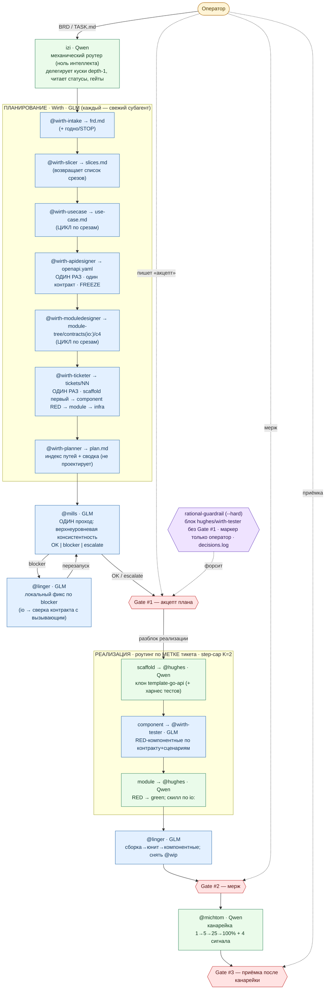

# Граф работы харнеса rationaldev (v2 — плоская диспетчеризация)

`izi` (оркестратор, Qwen) — **чисто механический роутер**: делегирует каждый кусок отдельным
субагентом **напрямую (depth 1)**, читает однострочные статусы, держит гейты. Всё планирование и
проектирование тикетов — **Wirth на GLM**; реализация — **Hughes на Qwen**; ревью — **Mills**,
фикс — **Linger** (GLM); релиз-здоровье — **Michtom** (Qwen). Никакой вложенности subagent→subagent.



## Легенда
- 🟩 **izi (Qwen)** — механический роутер: фикс. последовательность + чтение однострочных статусов
  + метки типов. Артефакты не читает, вердикты не сводит, уровень не оценивает.
- 🟦 **Wirth (GLM)** — всё планирование/проектирование/компонентные тесты (`@wirth-*`).
- 🟦 **Mills (GLM)** — верхнеуровневое ревью консистентности; 🟦 **Linger (GLM)** — локальный фикс.
- 🟩 **Hughes (Qwen)** — реализация scaffold/module; 🟩 **Michtom (Qwen)** — канареечный health.
- 🟨 **Оператор** — только 3 human-gate; «акцепт» на Gate #1 (touch-free через плагин).
- 🟪 **rational-guardrail** (`--hard`) — блок `hughes`/`wirth-tester` без Gate #1; маркер `gate1.approved` ставит только оператор.

## Ключевые принципы
- **Плоскость (depth 1):** izi делегирует субагентов напрямую; они дальше НЕ делегируют
  (вложенность subagent→subagent opencode не поддерживает — ask второго уровня не всплывает).
- **Один контракт на сервис:** `@wirth-apidesigner` вызывается ОДИН раз (не per-slice) → freeze до дизайна модулей.
- **Два прохода планирования:** дизайн срезов → нарезка тикетов (`@wirth-ticketer`, над всем планом).
- **Ревью верхнеуровневое:** Mills судит план как целое, не открывая каждый тикет; детали ловят этапы + компонентные + Linger.
- **Локальный фикс:** Linger чинит там, где проблема, сверяя контракт с вызывающим модулем — не переписывает план.
- **Без луупов:** `steps`-cap + счётчик попыток (K=2) + жёсткий блок guardrail → escalate оператору вместо кручения.
- **Скелет из шаблона:** scaffold-тикет (первый, сериализованно) клонирует `template-go-api`.
```
