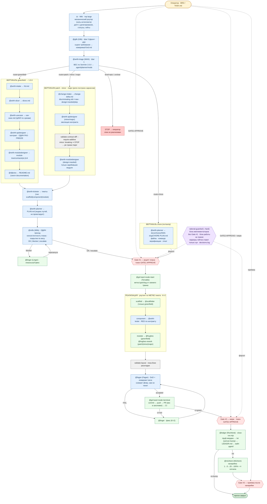

# Граф работы харнеса rationaldev (SemVer-вертикали, плоская диспетчеризация)

`izi` (дирижёр, тир **large**) — **чисто механический роутер**: делегирует каждый кусок отдельным
субагентом **напрямую (depth 1)**, читает однострочные статусы, держит гейты. Суждение живёт в
субагентах: планирование/проектирование — **Wirth**, ревью плана — **Mills**, реализация —
**Hughes**, фикс — **Linger**, приёмка — **Fagan**, git — **Torvalds**, закрытие прогона —
**Rochkind**, канарейка — **Michtom**. Никакой вложенности subagent→subagent.

Вертикаль выбирается **весом** (SemVer), который определил `@wirth-triage`; `izi` не классифицирует.

## Легенда
- 🟦 **тир large** — суждение: `izi`-роутинг, `@gilb`, `@wirth-*`, `@mills`, `@fagan`, `@linger`.
- 🟩 **тир small** — исполнение: `@hughes`/`@hughes-rework`, `@scaffolder`, `@git-hand`, `@ledger`, `@michtom`.
- ⬜ **детерминированные валидаторы** — `validate-contract-diff`, `validate-layout`, `validate-dod`,
  `close-run.mjs`/`semver-bump.mjs`: механика вместо суждения.
- 🟨 **Оператор** — только три human-gate, токены `GATE1 APPROVE` / `GATE2 APPROVE`.
- 🟪 **rational-guardrail** (`--hard`) — блок имплементаторов до Gate #1, блок работы на транке,
  маркеры гейтов ставит только хук.

## Ключевые принципы
- **Одна ось — вес.** Пять вертикалей (`greenfield|patch|minor|major|chore`); маршрутов «чужой репо»,
  разведки и conform-режима нет: харнес ведёт репозитории, которые построил сам.
- **Плоскость (depth 1):** izi делегирует субагентов напрямую; они дальше НЕ делегируют.
- **Один контракт на сервис:** `@wirth-apidesigner` вызывается ОДИН раз (не per-slice) → freeze до дизайна модулей.
- **Ревью верхнеуровневое:** Mills судит план как целое; под SemVer-вертикалью дополнительно проверяет
  непустой discriminating-сценарий и покрытие, соответствующее весу.
- **Локальный фикс:** Linger чинит там, где проблема, — не переписывает план; имплементатор своё красное не чинит.
- **Без луупов:** `steps`-cap + счётчик попыток (K=2) + жёсткий блок guardrail → escalate оператору.
- **Прогон закрывается явно:** тег/no-bump → запись в `docs/changes/LEDGER.md` → вайп `.agent/`;
  иначе `gate1.approved` прошлой задачи пропустит следующую.
