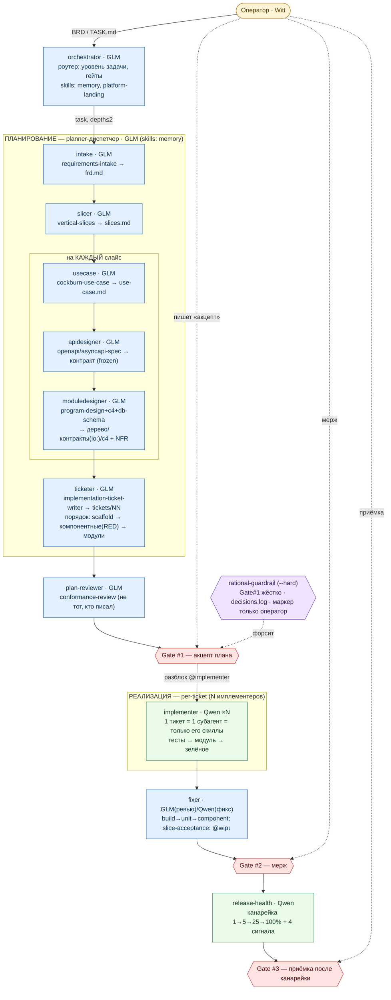

# Граф работы харнеса rationaldev

Полный поток: оркестрация → планирование (диспетчер + этап-роли) → Gate #1 → per-ticket реализация
→ фиксер → релиз. Модели: **GLM 5.2** (large — планирование/дизайн/ревью), **Qwen3.6-27b**
(small/medium — реализация/health). Каждая этап-роль грузит **только свой скилл** (малый контекст).



## Легенда
- 🔵 **GLM 5.2** — планирование/дизайн/ревью (large, temp 0.7 из `models.config.json`).
- 🟢 **Qwen3.6-27b** — реализация тикетов, канареечный health (small/medium).
- 🟡 **Оператор (Witt)** — только 3 human-gate; «акцепт» на Gate #1 (touch-free через плагин).
- 🔴 **Gate #1/2/3** — акцепт плана / мерж / приёмка после канарейки.
- 🟣 **rational-guardrail** — плагин `--hard`: жёстко блокирует implementer без Gate #1, пишет `decisions.log`, маркер `gate1.approved` ставит только оператор (агент не может).

## Ключевые принципы на графе
- **Диспетчеризация:** planner не делает этапы сам — делегирует их субагентам (свежий малый контекст, свой скилл).
- **io-router:** тип I/O модуля (`io: none|http|llm|queue|db`) → набор скиллов в тикет; имплементер не выбирает.
- **Contract-first порядок:** спеки → компонентные тесты (RED) → модули (юнит-тесты) → GREEN.
- **Скелет из шаблона:** `service-scaffold` клонирует `template-go-api` (не жжём токены на boilerplate).
```
