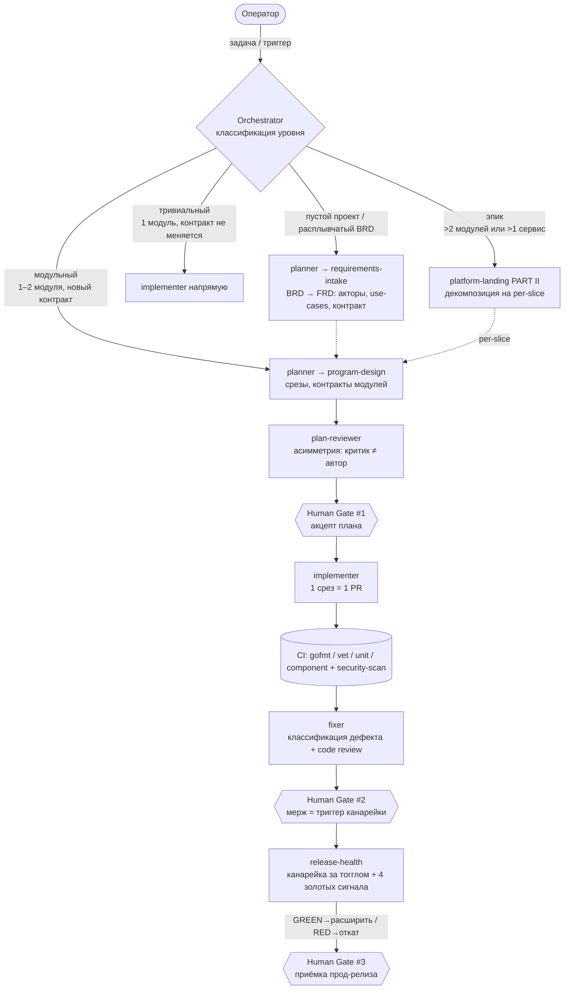
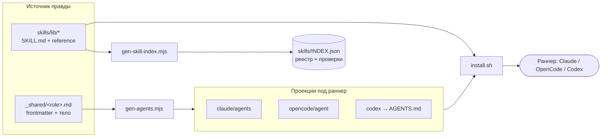

# Харнес rationaldev — как устроен и как работает

Краткий обзор мультиагентного харнеса: точка входа, маршрутизация по ролям, гейты,
и базовые концепции (агенты, описания ролей, скиллы). Это **концептуальный хаб** —
механика установки/генерации и процесс лежат в связанных документах (см. «Куда дальше»).

> Это адаптированный материал поверх открытых стандартов Anthropic (Agent Skills,
> Claude Code subagents) и конвенции `AGENTS.md`. Первоисточники — в конце страницы.

## Что такое харнес

Подключаемый набор **ролей-агентов** (izi) и **скиллов** (детерминированных процедур),
который одной командой раскладывается под выбранный раннер (Claude / OpenCode / Codex) и
ведёт задачу по SDLC: от бизнес-требования до здоровой фичи в проде. Команда = человек +
машина: рутину Delivery ведут агенты, человек держит решения на **трёх гейтах**.

- **Роль** — system-prompt с машиночитаемой идентичностью (какой моделью, что грузит,
  что на входе/выходе). См. [roles в Claude Code](#первоисточники).
- **Скилл** — модульная процедура (`SKILL.md`), грузится ролью **по имени**. См.
  [agent-skills.md](agent-skills.md).
- Источник правды — `harness/agents/_shared/<role>.md` + `skills/lib/*`; из него
  генерятся проекции под раннеры (`harness/README.md`).

## Overview workflow (happy path)

```text
[Задача] → Orchestrator (классификация уровня)
   → PLANNING (planner: requirements-intake → program-design)
   → PLAN REVIEW (plan-reviewer)  → Human Gate #1 (акцепт плана)
   → IMPLEMENTATION (implementer, 1 срез = 1 PR) → CI → CODE REVIEW (fixer)
                                                   → Human Gate #2 (мерж)
   → RELEASE (release-health: канарейка за тогглом + 4 золотых сигнала)
                                                   → Human Gate #3 (приёмка)
```

## C4 — как оркестратор распределяет роли (с гейтами)



## C4 — как харнес собран (источник → проекции → раннер)



## Базовые концепции

### Маршрутизация (routing)
Точка входа — роль **orchestrator** (дирижёр-роутер). Она не пишет код и не проектирует:
**классифицирует уровень задачи** (пустой проект / тривиальный / модульный / эпик) и
делегирует субагентам по таблице. Языко-чувствителен только этот слой — скиллы грузятся
**по имени**, поэтому язык триггера важен лишь для классификации (манифесты ролей — на
русском). Точка входа детерминирована таблицей в манифесте orchestrator.

### Агенты (роли)
Шесть ролей izi: `orchestrator` (Witt, человек-дирижёр), `planner` (Wirth), `plan-reviewer`
(Mills), `implementer` (Hughes), `fixer` (Linger), `release-health` (Michtom). Каждая —
тонкий system-prompt: «кто я, какой моделью, что гружу, что на входе/выходе» + «как веду
задачу». Тяжёлая дисциплина вынесена в скиллы. Подробно — [roles.md](roles.md).

### Описание роли (frontmatter + тело)
`frontmatter` = машиночитаемый конфиг для **харнеса** (тир→модель, mode, temperature,
steps, `skills:`, `inputs/outputs`, `permission:`, `description` для роутинга);
**тело** = system-prompt для **модели** (поведение, STOP-правила, гейты). Разделение даёт
один источник → проекции под все раннеры + машинную валидацию конфига. См. [roles.md](roles.md).

### Скиллы
Скилл — модульная процедура (`SKILL.md` = frontmatter `name`/`description` + тело), грузится
ролью по имени. Тяжёлые скиллы используют **progressive disclosure** (лёгкий `SKILL.md` +
`reference/`). Как писать и зачем — [agent-skills.md](agent-skills.md); полный список —
[available-skills.md](available-skills.md).

## Гейты (контроль человека)

| Гейт | Когда | Что решает дирижёр |
|---|---|---|
| **#1 акцепт плана** | после plan-reviewer | принять / на доработку / вмешаться |
| **#2 мерж** | после fixer (CI зелёный + review OK) | мерж → триггерит канареечный выкат |
| **#3 приёмка** | стабильный GREEN после канарейки | подтвердить (мелкие — авто) |

## Куда дальше

- Установка и первая задача — [`docs/get-started.md`](../get-started.md).
- Механика проекций под раннеры — [`harness/README.md`](../../harness/README.md).
- Процесс целиком и диаграмма — [`docs/00_PROCESS.md`](../00_PROCESS.md), [`docs/01_DIAGRAM.md`](../01_DIAGRAM.md), `docs/SDLC.svg`.
- Концепция и научный фундамент — [`CONCEPT.md`](../../CONCEPT.md).
- Глоссарий — [`GLOSSARY.md`](../../GLOSSARY.md).

## Первоисточники

- Claude Code Subagents — https://code.claude.com/docs/en/sub-agents
- Agent Skills (Claude Platform Docs) — https://platform.claude.com/docs/en/agents-and-tools/agent-skills/overview
- Equipping agents for the real world with Agent Skills (Anthropic) — https://www.anthropic.com/engineering/equipping-agents-for-the-real-world-with-agent-skills
- Building effective agents (Anthropic) — https://www.anthropic.com/engineering/building-effective-agents
- AGENTS.md — https://agents.md
