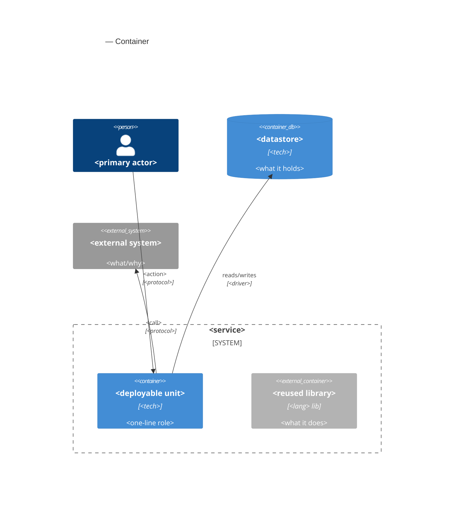
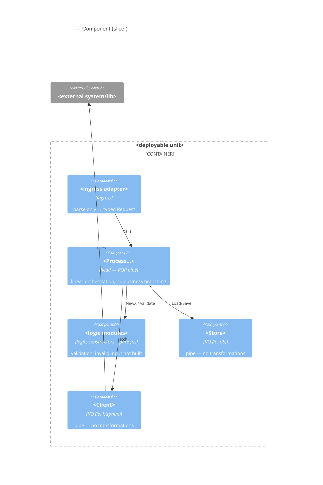

# c4.skill — the slice's C4 model (C2 + C3)

## Purpose

**In:** the slice's module tree + head-pipe pseudocode (`program-design` stage 8,
`docs/design/<slice>/module-tree.md`) and the frozen contract. **Out:**
`docs/design/<slice>/c4.md` — **C2 Container** and **C3 Component** as Mermaid diagrams that render
on GitHub without plugins.

Levels ownership:
- **C1** System Context → the concept landing (`platform-landing`); here only a link.
- **C2** Container → this file.
- **C3** Component = **the program-design module tree** → this file.
- **C4** (code) → **not drawn** (signatures live in the design cards).
- Cockburn use case → the neighbor `docs/design/<slice>/use-case.md` (`cockburn-use-case`); link it,
  do not re-author it.

## Scope

DO:
- Render C2 and C3 for the slice, in Mermaid, from the existing module tree.
- Make C3 match the module tree node-for-node; show honest-reuse libraries as external containers.
- Link the head-pipe flow and the neighbor `use-case.md`.

DON'T:
- Invent modules or dependencies not in the module tree (that is `program-design` — go back).
- Draw C1 (landing) or C4 (code).
- Re-author the Cockburn use case (that is `cockburn-use-case`).

## C2 — Container (template)

One deployable unit + honestly-reused libraries as external containers. Fill from the stack.



## C3 — Component = the slice's module tree (template)

Dependencies point **inward**: ingress → head → {logic, I/O}. Logic knows nothing of
cobra/http/os/time; I/O objects implement interfaces declared by the head. **Every node here is a
module from `module-tree.md`; the `io:` tag from the contract decides logic vs I/O.**



Below C3, one line of the **head-pipe flow** (from `module-tree.md`):

```
cmd → ProcessSlice → Store.Load → NewX → Client.Fetch → buildResponse → result
```

## Hard rules

- **C3 == module tree.** Node set and edges match `module-tree.md` exactly; a node here that isn't
  in the tree (or vice versa) → STOP, reconcile with `program-design`.
- **Dependencies inward only.** A lower module never knows an upper one; logic never references I/O
  libraries; I/O objects are the only externally-connected components.
- **I/O nodes are pipes.** Label each I/O component with its `io:` tag and "pipe — no
  transformations" (consistent with `program-design` Step 6).
- **Mermaid only.** `C4Container`/`C4Component` blocks (render on GitHub); no images, no plugins.
- **Only C2 + C3.** No C1 (landing link instead), no C4 (code).

## STOP

- No `module-tree.md` (stage 8) → STOP, run `program-design` first.
- C3 would need a module/dependency absent from the tree → STOP, fix the tree in `program-design`,
  don't invent it here.
- Asked to draw C1 or C4, or to write the use case here → STOP (wrong owner).

## Definition of Done

- `docs/design/<slice>/c4.md` has C2 and C3 in Mermaid; both render.
- C3 matches `module-tree.md` node-for-node; deps inward; I/O nodes tagged `io:` + "pipe".
- Head-pipe flow line present; link to the neighbor `use-case.md` and to the landing's C1.

## Foundations

C4 model (Brown) — C1 context / C2 container / C3 component; Mermaid `C4*` diagrams. Example layout:
[`pinout-openapi/docs/design/contract-validate/c4.md`](https://github.com/codemonstersteam/pinout-openapi/blob/main/docs/design/contract-validate/c4.md)
(registry: [`docs/templates/README.md`](../../../docs/templates/README.md)). Pairs with
`program-design` (module tree = C3) and `cockburn-use-case` (neighbor use case).
