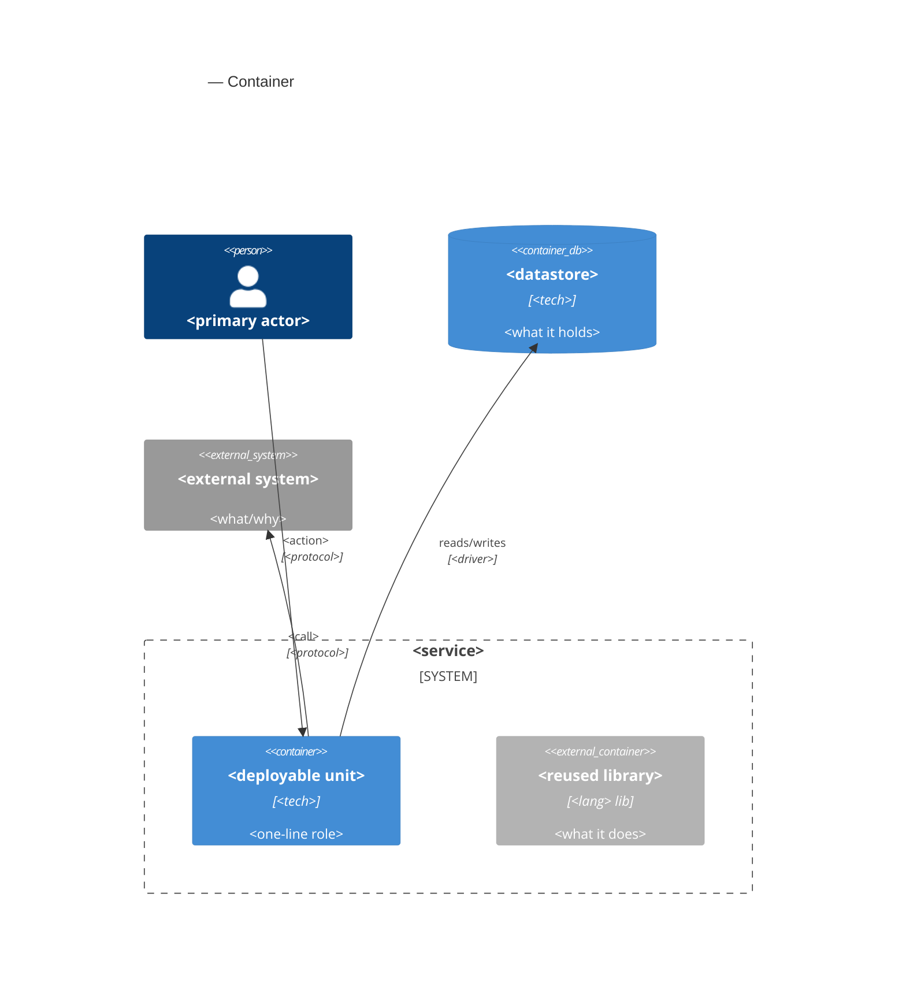
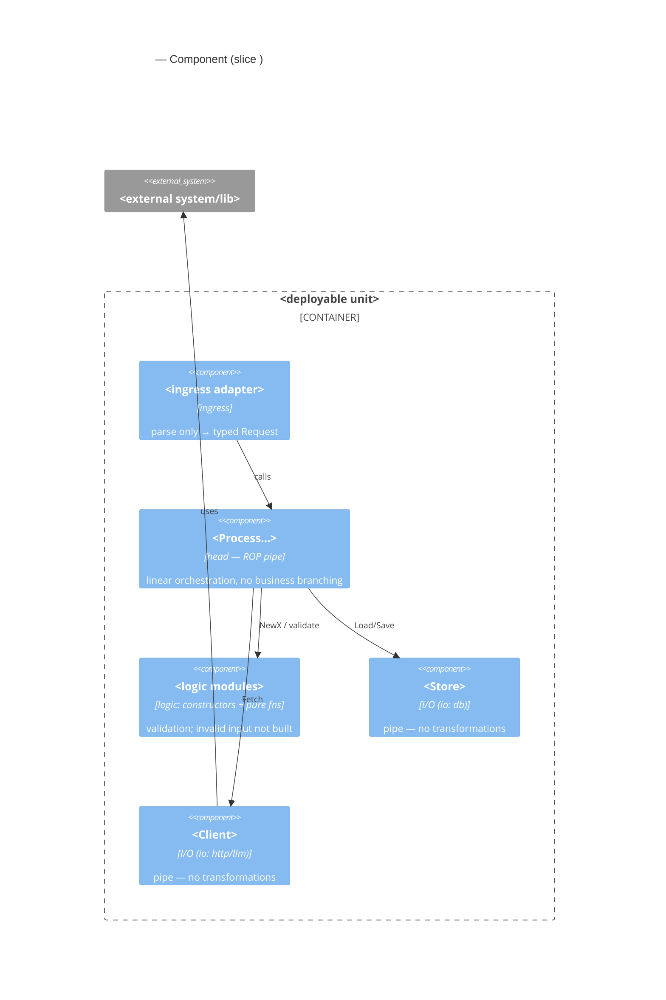

# c4 · templates — C2/C3 Mermaid blocks (companion)

> Companion к [`SKILL.md`](./SKILL.md). Читай **когда рисуешь** `c4.md` (роль-дизайнер):
> готовые Mermaid-шаблоны C2/C3 + пример head-pipe + foundations. Ревьюер (`mills`) сверяет
> по Hard rules в `SKILL.md` и это НЕ читает.

## C2 — Container (template)

One deployable unit + honestly-reused libraries as external containers. Fill from the stack.



## C3 — Component = the slice's module tree (template)

Dependencies point **inward**: ingress → head → {logic, I/O}. Logic knows nothing of
cobra/http/os/time; I/O objects implement interfaces declared by the head. **Every node here is a
module from `module-tree.md`; the `io:` tag from the contract decides logic vs I/O.**



Below C3, one line of the **head-pipe flow** (from `module-tree.md`):

```
cmd → ProcessSlice → Store.Load → NewX → Client.Fetch → buildResponse → result
```

## Foundations

C4 model (Brown) — C1 context / C2 container / C3 component; Mermaid `C4*` diagrams. Example layout:
[`pinout-openapi/docs/design/contract-validate/c4.md`](https://github.com/codemonstersteam/pinout-openapi/blob/main/docs/design/contract-validate/c4.md)
(registry: [`docs/templates/README.md`](../../../docs/templates/README.md)). Pairs with
`program-design` (module tree = C3) and `cockburn-use-case` (neighbor use case).
